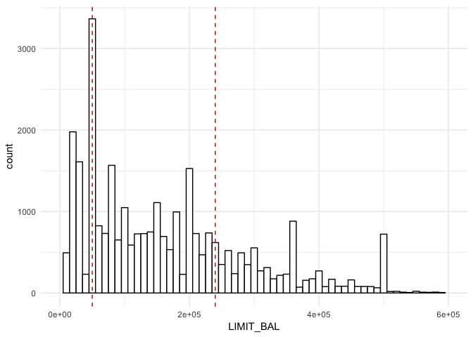
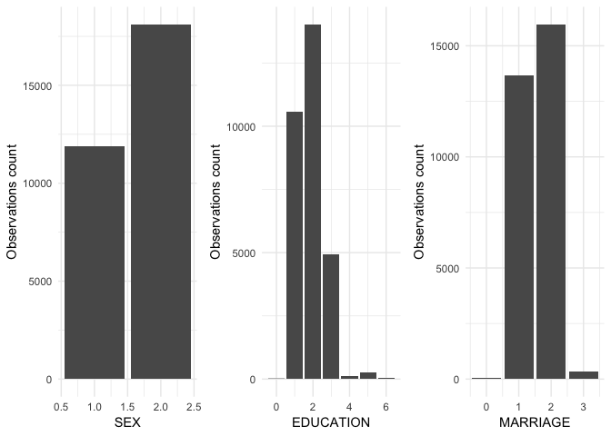
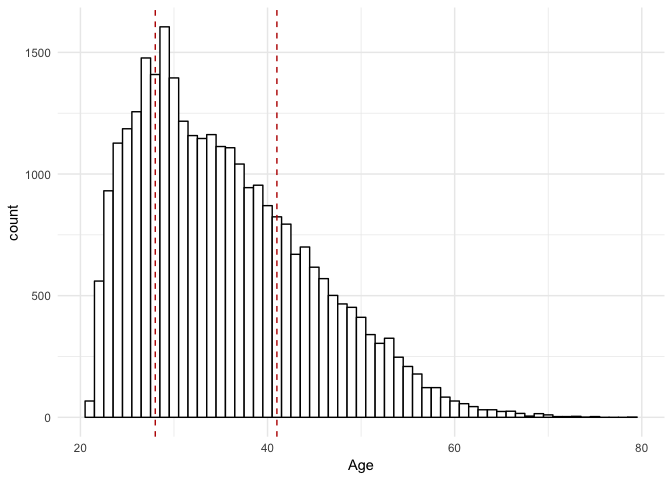
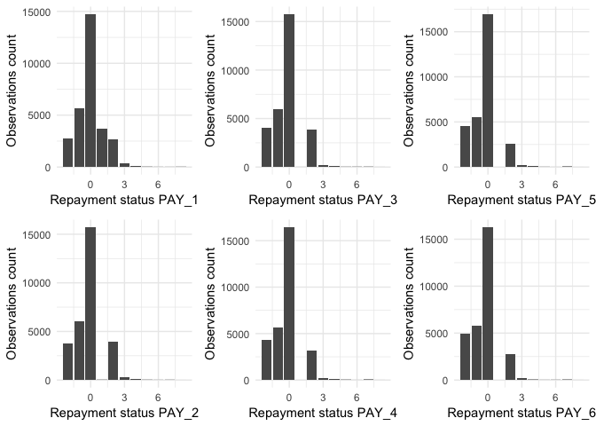
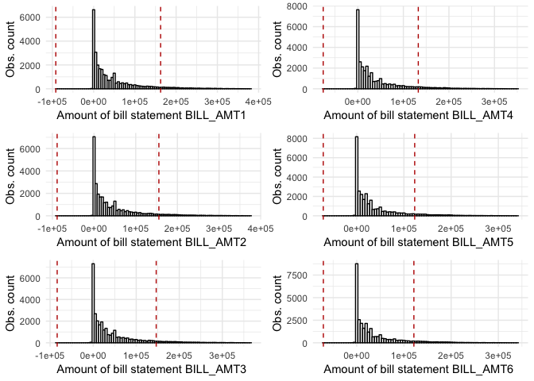
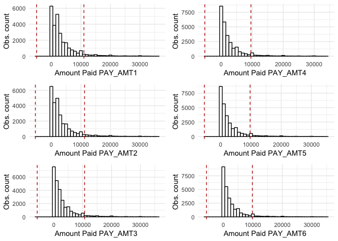
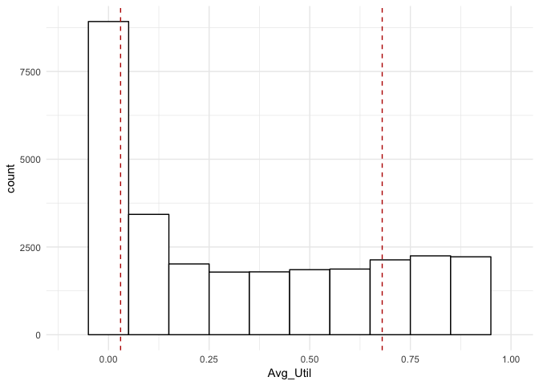
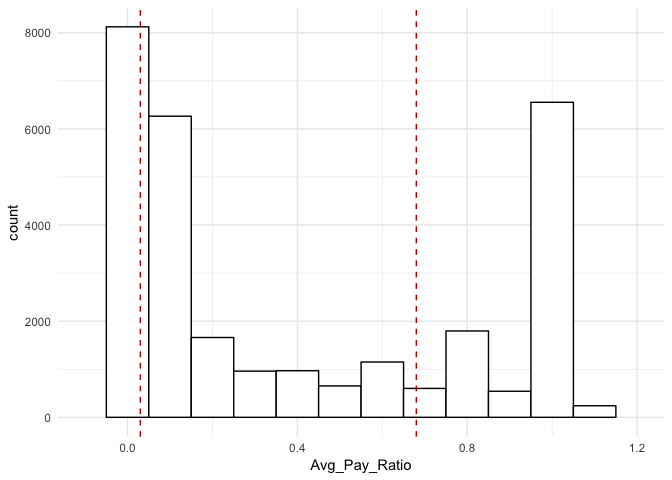

Credit Problem - EDA & Data Transformation
================
Daniel Macdonald @talentrics
5/21/2019

### Project Description

This notebook is the first of 3 published for my [MSDS Capstone
Project](https://sps.northwestern.edu/masters/data-science/curriculum-specializations.php)
at Northwestern University.  
The objective of this project is to demonstrate core MSDS programming
and data analysis skills.

These notebooks support analysis published in the [Summary: Model
Development Guide
(PDF)](https://github.com/talentrics/MSDS_Capstone_Project/blob/master/Credit_Problem_4_Model_Development_Guide.pdf)

**Below is a summary of the notebooks published in relation to this
project:**

  - [EDA & Data
    Transformation](https://github.com/talentrics/MSDS_Capstone_Project/blob/master/Credit_Problem_1_EDA.md)
    **(This Notebook)**  
  - [Random Forest and Gradient Boosting
    Analysis](https://github.com/talentrics/MSDS_Capstone_Project/blob/master/Credit_Problem_2_Tree_Models.md)  
  - [Regression and Principal Components
    Analysis](https://github.com/talentrics/MSDS_Capstone_Project/blob/master/Credit_Problem_3_Regression_Models.md)

### Data Overview

  - Source: [‘Default of Credit Card Clients Data
    Set’](https://archive.ics.uci.edu/ml/datasets/default+of+credit+card+clients)
    on UCI Machine Learning Repository.  
  - The data were provided by a bank in Taiwan in 2016 for purposes of
    ‘default’ prediction.
  - The data are 30,000 individual customer observations with 30
    attributes.
  - Observations were over a six month period from April to September of
    2005.
  - Attributes = available credit, gender, age, marital status, & bill
    payment.
  - Response variable = ‘DEFAULT’ - did the customer default (1 = True).

This notebook summarizes Exploratory Data Analysis and Data
Tranformation.  
Model development and testing of predictions in notebooks linked above.

### Raw Data Review

Data installed from RData file saved on local computer. File used for
Capstone project is unique compared to raw data on UCI data to apply
consistent train/test/validate split. Project specific file can be found
in the [github
repository/data.](https://github.com/talentrics/MSDS_Capstone_Project/blob/master/data/credit_card_default.RData)

``` r
# Read the RData object using readRDS();
credit_card_default <- readRDS('/Users/talentrics/credit_card_default.RData')

# Show dataframe structure;
str(credit_card_default)
```

    ## 'data.frame':    30000 obs. of  30 variables:
    ##  $ ID        : int  1 2 3 4 5 6 7 8 9 10 ...
    ##  $ LIMIT_BAL : int  20000 120000 90000 50000 50000 50000 500000 100000 140000 20000 ...
    ##  $ SEX       : int  2 2 2 2 1 1 1 2 2 1 ...
    ##  $ EDUCATION : int  2 2 2 2 2 1 1 2 3 3 ...
    ##  $ MARRIAGE  : int  1 2 2 1 1 2 2 2 1 2 ...
    ##  $ AGE       : int  24 26 34 37 57 37 29 23 28 35 ...
    ##  $ PAY_0     : int  2 -1 0 0 -1 0 0 0 0 -2 ...
    ##  $ PAY_2     : int  2 2 0 0 0 0 0 -1 0 -2 ...
    ##  $ PAY_3     : int  -1 0 0 0 -1 0 0 -1 2 -2 ...
    ##  $ PAY_4     : int  -1 0 0 0 0 0 0 0 0 -2 ...
    ##  $ PAY_5     : int  -2 0 0 0 0 0 0 0 0 -1 ...
    ##  $ PAY_6     : int  -2 2 0 0 0 0 0 -1 0 -1 ...
    ##  $ BILL_AMT1 : int  3913 2682 29239 46990 8617 64400 367965 11876 11285 0 ...
    ##  $ BILL_AMT2 : int  3102 1725 14027 48233 5670 57069 412023 380 14096 0 ...
    ##  $ BILL_AMT3 : int  689 2682 13559 49291 35835 57608 445007 601 12108 0 ...
    ##  $ BILL_AMT4 : int  0 3272 14331 28314 20940 19394 542653 221 12211 0 ...
    ##  $ BILL_AMT5 : int  0 3455 14948 28959 19146 19619 483003 -159 11793 13007 ...
    ##  $ BILL_AMT6 : int  0 3261 15549 29547 19131 20024 473944 567 3719 13912 ...
    ##  $ PAY_AMT1  : int  0 0 1518 2000 2000 2500 55000 380 3329 0 ...
    ##  $ PAY_AMT2  : int  689 1000 1500 2019 36681 1815 40000 601 0 0 ...
    ##  $ PAY_AMT3  : int  0 1000 1000 1200 10000 657 38000 0 432 0 ...
    ##  $ PAY_AMT4  : int  0 1000 1000 1100 9000 1000 20239 581 1000 13007 ...
    ##  $ PAY_AMT5  : int  0 0 1000 1069 689 1000 13750 1687 1000 1122 ...
    ##  $ PAY_AMT6  : int  0 2000 5000 1000 679 800 13770 1542 1000 0 ...
    ##  $ DEFAULT   : int  1 1 0 0 0 0 0 0 0 0 ...
    ##  $ u         : num  0.288 0.788 0.409 0.883 0.94 ...
    ##  $ train     : num  1 0 1 0 0 1 0 0 0 1 ...
    ##  $ test      : num  0 0 0 0 0 0 1 0 1 0 ...
    ##  $ validate  : num  0 1 0 1 1 0 0 1 0 0 ...
    ##  $ data.group: num  1 3 1 3 3 1 2 3 2 1 ...

Install woeBinning, ggplot2 & create multiplot function for future
plotting

``` r
#install.packages('woeBinning',dependencies=TRUE)
library(woeBinning)

#install.packages("dplyr")
library(dplyr)
library(ggplot2)

## MultiPlot Function: 
MultiPlot <- function(..., plotlist=NULL, file, cols=1, layout=NULL) {
  require(grid)
  
  # Make a list from the ... arguments and plotlist
  plots <- c(list(...), plotlist)
  
  numPlots = length(plots)
  
  # If layout is NULL, then use 'cols' to determine layout
  if (is.null(layout)) {
    # Make the panel
    # ncol: Number of columns of plots
    # nrow: Number of rows needed, calculated from # of cols
    layout <- matrix(seq(1, cols * ceiling(numPlots/cols)),
                     ncol = cols, nrow = ceiling(numPlots/cols))
  }
  
  if (numPlots==1) {
    print(plots[[1]])
    
  } else {
    # Set up the page
    grid.newpage()
    pushViewport(viewport(layout = grid.layout(nrow(layout), ncol(layout))))
    
    # Make each plot, in the correct location
    for (i in 1:numPlots) {
      # Get the i,j matrix positions of the regions that contain this subplot
      matchidx <- as.data.frame(which(layout == i, arr.ind = TRUE))
      
      print(plots[[i]], vp = viewport(layout.pos.row = matchidx$row,
                                      layout.pos.col = matchidx$col))
    }
  }
}
```

Rename data set \> update column names \> plot distributions

``` r
#rename data set
raw.data <- credit_card_default

#update column name for 'PAY_0' to 'PAY_1'
colnames(raw.data)[which(colnames
    (raw.data) == 'PAY_0')] <- 'PAY_1'

# Converting columns to factors according to the data description 
pay.cols.names  <- paste0("PAY_", c(1:6))  # "PAY_1" "PAY_2" "PAY_3"...
```

## Explore & Transform - LIMIT\_BAL

**data description:** integer - individual consumer credit &
supplementary credit in NT Dollar

``` r
summary(raw.data$LIMIT_BAL)
```

    ##    Min. 1st Qu.  Median    Mean 3rd Qu.    Max. 
    ##   10000   50000  140000  167484  240000 1000000

**Histogram - LIMIT\_BAL**

``` r
# Getting ID and LIMIT_BAL columns only
limit.raw.data <- raw.data[c(2)]

# Generating a histogram for the LIMIT_BAL variable with a vertical cutoff line
limit.hist.plot <-
  ggplot(data = limit.raw.data, 
         aes(x = limit.raw.data$LIMIT_BAL)) +
  geom_histogram(binwidth = 10000,
                 colour = "black", fill = "white") +
  geom_vline(aes(xintercept = 50000), 
             colour = "#BB0000", linetype = "dashed") +
  geom_vline(aes(xintercept = 240000), 
             colour = "#BB0000", linetype = "dashed") +
  theme_minimal() +
  xlim(0,600000) +
  xlab("LIMIT_BAL")

# Printing both plots near each other
MultiPlot(limit.hist.plot, cols = 1)
```

<!-- -->

**bin analysis - LIMIT BAL** - investigate binning options for variable
split

``` r
# Check bins LIMIT_BAL
LIMIT_BAL.bins <- raw.data[,c("LIMIT_BAL","DEFAULT")]

LIMIT_BAL.bin <- woe.binning(df=LIMIT_BAL.bins,target.var=c("DEFAULT"),
                               pred.var=c("LIMIT_BAL"))

table_limit <- as.data.frame(woe.binning.table(LIMIT_BAL.bin))
table_limit <- table_limit[,-c(6:7,10)]
colnames(table_limit) <- c('Final.Bin','Total.Count','Distr','0.Count','1.Count','Rate','WOE')
table_limit
```

    ##   Final.Bin Total.Count  Distr 0.Count 1.Count  Rate   WOE
    ## 1  <= 30000        4081  13.6%    2618    1463 35.8% -67.7
    ## 2 <= 160000       13013  43.4%    9830    3183 24.5% -13.1
    ## 3    <= Inf       12906  43.0%   10916    1990 15.4%  44.3
    ## 5     Total       30000 100.0%   23364    6636 22.1%    NA

**recommended transformation - LIMIT\_BAL** Dummy variables if
LIMIT\_BAL is below 30k or above 60k  
Leave out \>30k & \< 160k as cross correlation would render this
variable irrelevant.

``` r
raw.data$LIMIT_BAL_below_30k <- ifelse(raw.data$LIMIT_BAL <= 30000,1,0)
raw.data$LIMIT_BAL_above_160k <- ifelse(raw.data$LIMIT_BAL > 160000,1,0)
summary((raw.data[,c('LIMIT_BAL_below_30k','LIMIT_BAL_above_160k')]))
```

    ##  LIMIT_BAL_below_30k LIMIT_BAL_above_160k
    ##  Min.   :0.000       Min.   :0.0000      
    ##  1st Qu.:0.000       1st Qu.:0.0000      
    ##  Median :0.000       Median :0.0000      
    ##  Mean   :0.136       Mean   :0.4302      
    ##  3rd Qu.:0.000       3rd Qu.:1.0000      
    ##  Max.   :1.000       Max.   :1.0000

**Binning for regression analysis - in case of tree analysis, continuous
variable recommended.**

## Explore & Transform - Demographics:

**data descriptions:**  
**SEX** Categorical: (1) = Male; (2) = Female  
**EDUCATION** Categorical: (1) = graduate school; (2) = university; (3)
= high school; (4) = others  
**MARRIAGE** Categorical: (1) = married; (2) = single; (3) = others

``` r
summary(raw.data[,c(3:5)])
```

    ##       SEX          EDUCATION        MARRIAGE    
    ##  Min.   :1.000   Min.   :0.000   Min.   :0.000  
    ##  1st Qu.:1.000   1st Qu.:1.000   1st Qu.:1.000  
    ##  Median :2.000   Median :2.000   Median :2.000  
    ##  Mean   :1.604   Mean   :1.853   Mean   :1.552  
    ##  3rd Qu.:2.000   3rd Qu.:2.000   3rd Qu.:2.000  
    ##  Max.   :2.000   Max.   :6.000   Max.   :3.000

**Histogram: SEX, EDUCATION, MARRIAGE**

``` r
# Getting social predictors only 
dem.raw.data <- raw.data[,c(3:5)]

# Generating bar plots for social predictors (SEX, EDUCATION, MARRIAGE)
dem.histograms <- 
  lapply(colnames(dem.raw.data), 
         function (pay.col.name){ 
           ggplot(data = raw.data[, pay.cols.names], 
                  aes(x = raw.data[, pay.col.name])) +
             geom_bar(stat = "count") + 
             theme_minimal() +
             xlab(pay.col.name) +
             ylab("Observations count")
         })
MultiPlot(plotlist = dem.histograms, cols = 3)
```

<!-- -->

**observations & recommendations for transformation:**

**SEX** predominately female, suggestion to change categories to (0) =
male; (1) = female

``` r
raw.data$SEX_FEMALE <- ifelse(raw.data$SEX == 2,1,0)
```

**MARRIAGE** ‘other’ values (0) & (3) outliers - change categories to
(1) = Married; (0) = Not Married

``` r
raw.data$Married_Y <- ifelse(raw.data$MARRIAGE == 1,1,0)
summary(raw.data$Married_Y)
```

    ##    Min. 1st Qu.  Median    Mean 3rd Qu.    Max. 
    ##  0.0000  0.0000  0.0000  0.4553  1.0000  1.0000

**Categorical frequency - EDUCATION**

``` r
ed_summary <-raw.data[,c(4)]
ed_table <- as.data.frame(table(ed_summary))
colnames(ed_table) <- c('EDUCATION','Freq')
ed_table$PCT <- ed_table$Freq/30000
ed_table$PCT <- paste(round(ed_table$PCT*100,digits=1),"%",sep="")
ed_table
```

    ##   EDUCATION  Freq   PCT
    ## 1         0    14    0%
    ## 2         1 10585 35.3%
    ## 3         2 14030 46.8%
    ## 4         3  4917 16.4%
    ## 5         4   123  0.4%
    ## 6         5   280  0.9%
    ## 7         6    51  0.2%

**EDUCATION** un-defined values (0), (5), & (6) ~1.1% - change all
‘other’ to category (0)

``` r
ed_df3 <- raw.data[,c(4,25)]
ed_df3$EDUCATION[ed_df3$EDUCATION>3 ] <- 0
ed_table2 <- as.data.frame(table(ed_df3$EDUCATION))
colnames(ed_table2) <- c('EDUCATION','Freq')
ed_table2$PCT <- ed_table2$Freq/30000
ed_table2$PCT <- paste(round(ed_table2$PCT*100,digits=1),"%",sep="")
ed_table2
```

    ##   EDUCATION  Freq   PCT
    ## 1         0   468  1.6%
    ## 2         1 10585 35.3%
    ## 3         2 14030 46.8%
    ## 4         3  4917 16.4%

**EDUCATION - bin analysis** - investigate binning options for variable
split

``` r
ED.bin <- woe.binning(df=ed_df3,target.var=c("DEFAULT"),pred.var=c("EDUCATION"))
table1 <- as.data.frame(woe.binning.table(ED.bin))
table1 <- table1[,-c(6:7,10)]
colnames(table1) <- c('Final.Bin','Total.Count','Distr','0.Count','1.Count','Rate','WOE')
table1
```

    ##   Final.Bin Total.Count  Distr 0.Count 1.Count  Rate   WOE
    ## 1      <= 1       11053  36.8%    8984    2069 18.7%  21.0
    ## 2    <= Inf       18947  63.2%   14380    4567 24.1% -11.2
    ## 4     Total       30000 100.0%   23364    6636 22.1%    NA

**EDUCATION - recommended transformation** Reduce variable to two
classes: **$ED\_Grad\_Other** = (0) = high school/university; (1) =
Graduate/Other

``` r
raw.data$ED_Grad_other <- ifelse((raw.data$EDUCATION < 1) | 
                             (raw.data$EDUCATION > 3) |(raw.data$EDUCATION == 1),1,0)
ed_table3 <- as.data.frame(table(raw.data$ED_Grad_other))
colnames(ed_table3) <- c('EDUCATION','Freq')
ed_table3$PCT <- ed_table3$Freq/30000
ed_table3$PCT <- paste(round(ed_table3$PCT*100,digits=1),"%",sep="")
ed_table3
```

    ##   EDUCATION  Freq   PCT
    ## 1         0 18947 63.2%
    ## 2         1 11053 36.8%

## Explore & Transform - AGE

**data description:** integer - age of customer in years

``` r
summary(raw.data$AGE)
```

    ##    Min. 1st Qu.  Median    Mean 3rd Qu.    Max. 
    ##   21.00   28.00   34.00   35.49   41.00   79.00

**Histogram - AGE**

``` r
# Getting ID and AGE columns only
age.raw.data <- raw.data[c(1,6)]

# Generating a histogram for the AGE variable with a vertical cutoff line
age.hist.plot <-
  ggplot(data = age.raw.data, 
         aes(x = age.raw.data$AGE)) +
  geom_histogram(binwidth = 1,
                 colour = "black", fill = "white") +
  geom_vline(aes(xintercept = 28), 
             colour = "#BB0000", linetype = "dashed") +
  geom_vline(aes(xintercept = 41), 
             colour = "#BB0000", linetype = "dashed") +
  theme_minimal() +
  xlab("Age")

# Printing both plots near each other
MultiPlot(age.hist.plot, cols = 1)
```

<!-- -->
**bin analysis - AGE** - investigate binning options for variable split

``` r
# Check bins LIMIT_BAL
AGE.bins <- raw.data[,c("AGE","DEFAULT")]

AGE.bin <- woe.tree.binning(df=AGE.bins,target.var=c("DEFAULT"),
                               pred.var=c("AGE"))

table_AGE <- as.data.frame(woe.binning.table(AGE.bin))
table_AGE <- table_AGE[,-c(6:7,10)]
colnames(table_AGE) <- c('Final.Bin','Total.Count','Distr','0.Count','1.Count','Rate','WOE')
table_AGE
```

    ##   Final.Bin Total.Count  Distr 0.Count 1.Count  Rate   WOE
    ## 1     <= 25        3871  12.9%    2839    1032 26.7% -24.7
    ## 2     <= 35       12938  43.1%   10373    2565 19.8%  13.9
    ## 3     <= 45        8522  28.4%    6661    1861 21.8%   1.6
    ## 4    <= Inf        4669  15.6%    3491    1178 25.2% -17.2
    ## 6     Total       30000 100.0%   23364    6636 22.1%    NA

**recommended transformation - AGE** Dummy variables if AGE is below 25,
25:35 & above 40  
Leave out \>35 & \< 40 as cross correlation would render this variable
irrelevant.

``` r
raw.data$AGE_below_25 <- ifelse(raw.data$AGE <= 25,1,0)
raw.data$AGE_25to35 <- ifelse((raw.data$AGE > 25) &
                                (raw.data$AGE <=35),1,0)
raw.data$AGE_above_40 <- ifelse(raw.data$AGE > 40,1,0)

summary(raw.data[,c('AGE_below_25','AGE_25to35','AGE_above_40')])
```

    ##   AGE_below_25     AGE_25to35      AGE_above_40   
    ##  Min.   :0.000   Min.   :0.0000   Min.   :0.0000  
    ##  1st Qu.:0.000   1st Qu.:0.0000   1st Qu.:0.0000  
    ##  Median :0.000   Median :0.0000   Median :0.0000  
    ##  Mean   :0.129   Mean   :0.4313   Mean   :0.2758  
    ##  3rd Qu.:0.000   3rd Qu.:1.0000   3rd Qu.:1.0000  
    ##  Max.   :1.000   Max.   :1.0000   Max.   :1.0000

**Binning for regression analysis - in case of tree analysis, continuous
variable recommended.**

## Explore & Transform - ‘PAY\_X’ variables

**data description:** 0 = ‘on time payment’ - positive \#’s = months
payment delay.

``` r
summary(raw.data[,c(7:9)])
```

    ##      PAY_1             PAY_2             PAY_3        
    ##  Min.   :-2.0000   Min.   :-2.0000   Min.   :-2.0000  
    ##  1st Qu.:-1.0000   1st Qu.:-1.0000   1st Qu.:-1.0000  
    ##  Median : 0.0000   Median : 0.0000   Median : 0.0000  
    ##  Mean   :-0.0167   Mean   :-0.1338   Mean   :-0.1662  
    ##  3rd Qu.: 0.0000   3rd Qu.: 0.0000   3rd Qu.: 0.0000  
    ##  Max.   : 8.0000   Max.   : 8.0000   Max.   : 8.0000

``` r
summary(raw.data[,c(10:12)])
```

    ##      PAY_4             PAY_5             PAY_6        
    ##  Min.   :-2.0000   Min.   :-2.0000   Min.   :-2.0000  
    ##  1st Qu.:-1.0000   1st Qu.:-1.0000   1st Qu.:-1.0000  
    ##  Median : 0.0000   Median : 0.0000   Median : 0.0000  
    ##  Mean   :-0.2207   Mean   :-0.2662   Mean   :-0.2911  
    ##  3rd Qu.: 0.0000   3rd Qu.: 0.0000   3rd Qu.: 0.0000  
    ##  Max.   : 8.0000   Max.   : 8.0000   Max.   : 8.0000

**Histogram - PAY\_X Variables**

``` r
# Converting columns to factors according to the data description 
pay.cols.names  <- paste0("PAY_", c(1:6))  # "PAY_1" "PAY_2" "PAY_3"...

# Generating bar plots for PAY_0..6 variables 
pay.histograms <- 
  lapply(pay.cols.names, 
         function (pay.col.name){ 
           ggplot(data = raw.data[, pay.cols.names], 
                  aes(x = raw.data[, pay.col.name])) +
             geom_bar(stat = "count") + 
             theme_minimal() +
             xlab(paste0("Repayment status ", pay.col.name)) +
             ylab("Observations count")
         })

MultiPlot(plotlist = pay.histograms, cols = 3)
```

<!-- -->
**observation PAY\_X:** negative numbers to -2 (assumption of
pre-payment) up to +8 (default)  
High cross correlation between PAY\_X variables - recommend to summarize
PAY\_X

``` r
# check correlation of PAY_X Sum Variable
PAY_X.correlation <- cor(raw.data[,c('PAY_1','PAY_2',
            'PAY_3','PAY_4','PAY_5','PAY_6','DEFAULT')])
PAY_X.correlation <- as.data.frame(PAY_X.correlation)
PAY_X.correlation <- PAY_X.correlation[7]
PAY_X.correlation
```

    ##           DEFAULT
    ## PAY_1   0.3247937
    ## PAY_2   0.2635512
    ## PAY_3   0.2352525
    ## PAY_4   0.2166136
    ## PAY_5   0.2041489
    ## PAY_6   0.1868664
    ## DEFAULT 1.0000000

**recommended transformation - PAY\_X** create **$PAY\_X\_Sum\_6mo**
variable

``` r
raw.data$PAY_X_Sum_6mo <- rowSums(cbind(raw.data$PAY_1,raw.data$PAY_2,
                                  raw.data$PAY_3,raw.data$PAY_4,
                                  raw.data$PAY_5,raw.data$PAY_6))
summary(raw.data$PAY_X_Sum_6mo)
```

    ##    Min. 1st Qu.  Median    Mean 3rd Qu.    Max. 
    ## -12.000  -5.000   0.000  -1.095   0.000  36.000

**bin analysis - PAY\_X\_Sum\_6mo** - investigate binning options for
variable split

``` r
# check WOE recommended binning and correlation in PAY_X
PAY_X_bins <- raw.data[,c("PAY_X_Sum_6mo","DEFAULT")]
PAY_X_bin <- woe.tree.binning(df=PAY_X_bins,target.var=c("DEFAULT"),
                             pred.var=c("PAY_X_Sum_6mo"))

PAY_X_bin_table <- as.data.frame(woe.binning.table(PAY_X_bin))

table_X <- PAY_X_bin_table[,-c(6:7,10)]
colnames(table_X) <- c('Final.Bin','Total.Count','Distr',
                       '0.Count','1.Count','Rate','WOE')
table_X
```

    ##   Final.Bin Total.Count  Distr 0.Count 1.Count  Rate    WOE
    ## 1      <= 0       22867  76.2%   19708    3159 13.8%   57.2
    ## 2      <= 5        3950  13.2%    2484    1466 37.1%  -73.1
    ## 3    <= Inf        3183  10.6%    1172    2011 63.2% -179.9
    ## 5     Total       30000 100.0%   23364    6636 22.1%     NA

**recommended transformation - PAY\_X\_Sum\_6mo** Dummy variables if
PAY\_X\_sum is below 0 or above 5  
Leave out \> 0 to \<=5 as cross correlation would render this variable
irrelevant.

``` r
# bin the Sum as recommended and check correlation
raw.data$PAY_X_Sum_6mo_belowZero <- ifelse(raw.data$PAY_X_Sum_6mo <= 0,1,0)
raw.data$PAY_X_Sum_6mo_aboveFive <- ifelse(raw.data$PAY_X_Sum_6mo > 5,1,0)
summary(raw.data[,c('PAY_X_Sum_6mo_belowZero','PAY_X_Sum_6mo_aboveFive')])
```

    ##  PAY_X_Sum_6mo_belowZero PAY_X_Sum_6mo_aboveFive
    ##  Min.   :0.0000          Min.   :0.0000         
    ##  1st Qu.:1.0000          1st Qu.:0.0000         
    ##  Median :1.0000          Median :0.0000         
    ##  Mean   :0.7622          Mean   :0.1061         
    ##  3rd Qu.:1.0000          3rd Qu.:0.0000         
    ##  Max.   :1.0000          Max.   :1.0000

**observation - PAY\_X\_Sum\_6mo:** binning PAY\_X\_Sum as per WOE
maximizes correlation variance

``` r
# check correlation of PAY_X Sum Variable
PAY_X.correlation2 <- cor(raw.data[,c('PAY_X_Sum_6mo_belowZero',
                          'PAY_X_Sum_6mo_aboveFive','DEFAULT')])
PAY_X.correlation2 <- as.data.frame(PAY_X.correlation2)
PAY_X.correlation2 <- PAY_X.correlation2[3]
PAY_X.correlation2
```

    ##                            DEFAULT
    ## PAY_X_Sum_6mo_belowZero -0.3582779
    ## PAY_X_Sum_6mo_aboveFive  0.3408162
    ## DEFAULT                  1.0000000

**Binning for regression analysis - in case of tree analysis, continuous
variable recommended.**

## Explore & Transform - Bill\_AMTX

**data description:** the amount of Bill Statement for 6 months April
(1) to September (6)

``` r
summary(raw.data[,c(13:15)])
```

    ##    BILL_AMT1         BILL_AMT2        BILL_AMT3      
    ##  Min.   :-165580   Min.   :-69777   Min.   :-157264  
    ##  1st Qu.:   3559   1st Qu.:  2985   1st Qu.:   2666  
    ##  Median :  22382   Median : 21200   Median :  20088  
    ##  Mean   :  51223   Mean   : 49179   Mean   :  47013  
    ##  3rd Qu.:  67091   3rd Qu.: 64006   3rd Qu.:  60165  
    ##  Max.   : 964511   Max.   :983931   Max.   :1664089

``` r
summary(raw.data[,c(16:18)])
```

    ##    BILL_AMT4         BILL_AMT5        BILL_AMT6      
    ##  Min.   :-170000   Min.   :-81334   Min.   :-339603  
    ##  1st Qu.:   2327   1st Qu.:  1763   1st Qu.:   1256  
    ##  Median :  19052   Median : 18104   Median :  17071  
    ##  Mean   :  43263   Mean   : 40311   Mean   :  38872  
    ##  3rd Qu.:  54506   3rd Qu.: 50190   3rd Qu.:  49198  
    ##  Max.   : 891586   Max.   :927171   Max.   : 961664

**Histogram - BILL\_AMTX Variables**

``` r
# Getting BILL_AMT1..6 columns only
bill.raw.data <- raw.data[c(13:18)]  

# Calculate cutoffs for the "rule of thumb"
(r.thumb.cutoffs <-
    apply(bill.raw.data, 2, function (t){
      c(Q1 = quantile(t, .25) - 1.5 * IQR(t),
        Q3 = quantile(t, .75) + 1.5 * IQR(t))
    }
    ) %>% t())
```

    ##              Q1.25%   Q3.75%
    ## BILL_AMT1 -91739.62 162389.4
    ## BILL_AMT2 -88547.50 155538.5
    ## BILL_AMT3 -83581.50 146412.5
    ## BILL_AMT4 -75942.12 132774.9
    ## BILL_AMT5 -70878.25 122831.8
    ## BILL_AMT6 -70657.38 121111.6

``` r
## Drawing histograms with cutoff lines ##
HistogramsFromVariables <- 
  function(data.columns, cutoffs.table = data.frame(), 
           bin.width = 5000, text = "") {
    # Generates list of ggplot histograms with vertical lines (cutoffs.table)
    #
    # Args:
    #   data.columns:  variables
    #   cutoffs.table: table with values for drawing vertical lines
    #   bin.width:     bin size for histograms. 
    #   text:          comment for the x axe 
    #
    # Returns:
    #   List of ggplot objects
    lapply(colnames(data.columns),
           function (col.name){ 
             h <- ggplot(data = data.columns, 
                         aes(x = data.columns[, col.name])) +
               geom_histogram(binwidth = bin.width, 
                              colour = "black", fill = "white") +
               theme_minimal() +
               xlab(paste0(text, " ", col.name, " ")) +
               ylab("Obs. count") 
             
             # Adjusting plot to data contained in cutoffs.table:
             # two, one or without cutoffs
             if (dim(cutoffs.table)[1] > 1) {
               h + geom_vline(aes(xintercept = cutoffs.table[col.name, "Q1.25%"]), 
                              colour = "#BB0000", linetype = "dashed") +
                 geom_vline(aes(xintercept = cutoffs.table[col.name, "Q3.75%"]), 
                            colour = "#BB0000", linetype = "dashed")  
             } else if (dim(cutoffs.table)[1] == 1) {
               h + geom_vline(aes(xintercept = cutoffs.table[1, col.name]), 
                              colour = "#BB0000", linetype = "dashed")
             } else {
               return(h)
             }
           })
  }

# Collecting indexes to remove
to.remove.indexes <- 
  lapply(colnames(bill.raw.data),
         function (bill.col.name){
           which(bill.raw.data[, bill.col.name] > 
                   r.thumb.cutoffs[bill.col.name, "Q3.75%"] + 220000 |
                   bill.raw.data[, bill.col.name] < 
                   r.thumb.cutoffs[bill.col.name, "Q1.25%"])
         }
  ) %>% unlist()

# Getting BILL_AMT1..6 columns without outliers
bill.raw.data <- bill.raw.data[-to.remove.indexes, ]

# Collecting observation indexes to remove from 
# the main data
to.remove.indexes.total <- to.remove.indexes  

# Plot Bill_AMT(X) #
MultiPlot(plotlist = HistogramsFromVariables(bill.raw.data, 
            r.thumb.cutoffs, text = "Amount of bill statement"),cols = 2)
```

<!-- -->

**observation - BILL\_AMTX:** …  
High cross correlation between BILL\_X variables - recommend to
summarize BILL\_X

``` r
# check correlation of BILL_X Sum Variable
BILL_X.correlation <- cor(raw.data[,c('BILL_AMT1','BILL_AMT2',
            'BILL_AMT3','BILL_AMT4','BILL_AMT5','BILL_AMT6','DEFAULT')])
BILL_X.correlation <- as.data.frame(BILL_X.correlation)
BILL_X.correlation <- BILL_X.correlation[7]
BILL_X.correlation
```

    ##                DEFAULT
    ## BILL_AMT1 -0.019644197
    ## BILL_AMT2 -0.014193218
    ## BILL_AMT3 -0.014075518
    ## BILL_AMT4 -0.010156496
    ## BILL_AMT5 -0.006760464
    ## BILL_AMT6 -0.005372315
    ## DEFAULT    1.000000000

**recommended transformation - BILL\_AMTX** develop variable to capture
bill/pay ratio

``` r
# option 1: sum of all bill values
raw.data$BILL_SUM <- rowSums(cbind(raw.data$BILL_AMT1,raw.data$BILL_AMT2,
                                  raw.data$BILL_AMT3,raw.data$BILL_AMT4,
                                  raw.data$BILL_AMT5,raw.data$BILL_AMT6))
# option 2: average bill amt
raw.data$Avg_Bill_Amt <- raw.data$BILL_SUM/6
# option 3: max bill over 6 months
## Create column Max_Bill_Amt ##
raw.data$Max_Bill_Amt <- pmax(raw.data$BILL_AMT1,raw.data$BILL_AMT2,
                              raw.data$BILL_AMT3,raw.data$BILL_AMT4,
                              raw.data$BILL_AMT5,raw.data$BILL_AMT6)

raw.data$Max_Bill_Amt_Sq <- raw.data$Max_Bill_Amt^2
raw.data$Max_Bill_Amt_Sqrt <- sqrt(raw.data$Max_Bill_Amt)
raw.data$Max_Bill_Amt_Log <- log(raw.data$Max_Bill_Amt)
```

**BILL\_X - analyze most highly correlated variable type**

``` r
# check correlation of BILL_X Sum Variable
BILL_X.correlation <- cor(raw.data[,c('BILL_SUM','Avg_Bill_Amt',
                                      'Max_Bill_Amt','Max_Bill_Amt_Sq',
                                      'DEFAULT')])
BILL_X.correlation <- as.data.frame(BILL_X.correlation)
BILL_X.correlation <- BILL_X.correlation[5]
BILL_X.correlation
```

    ##                     DEFAULT
    ## BILL_SUM        -0.01269136
    ## Avg_Bill_Amt    -0.01269136
    ## Max_Bill_Amt    -0.04091327
    ## Max_Bill_Amt_Sq -0.01613578
    ## DEFAULT          1.00000000

**Histogram - Max\_Bill\_Amt**

``` r
Max_bill_df <- raw.data[,c('ID','Max_Bill_Amt')]

summary(Max_bill_df$Max_Bill_Amt)
```

    ##    Min. 1st Qu.  Median    Mean 3rd Qu.    Max. 
    ##   -6029   10060   31208   60572   79599 1664089

**bin analysis - Max\_Bill\_Amt** - investigate binning options for
variable split

``` r
# check WOE recommended binning and correlation in PAY_X
Max_Bill_bins <- raw.data[,c("Max_Bill_Amt","DEFAULT")]
Max_Bill_bin <- woe.binning(df=Max_Bill_bins,target.var=c("DEFAULT"),
                             pred.var=c("Max_Bill_Amt"))

Max_Bill_bin_table <- as.data.frame(woe.binning.table(Max_Bill_bin))

Max_Bill_table <- Max_Bill_bin_table[,-c(6:7,10)]
colnames(Max_Bill_table) <- c('Final.Bin','Total.Count','Distr',
                       '0.Count','1.Count','Rate','WOE')
Max_Bill_table
```

    ##     Final.Bin Total.Count  Distr 0.Count 1.Count  Rate   WOE
    ## 1      <= 600        1507   5.0%    1029     478 31.7% -49.2
    ## 2     <= 4079        2994  10.0%    2200     794 26.5% -24.0
    ## 3 <= 18400.65        5999  20.0%    4707    1292 21.5%   3.4
    ## 4    <= 21034        1502   5.0%    1098     404 26.9% -25.9
    ## 5 <= 52496.15        7498  25.0%    5821    1677 22.4%  -1.4
    ## 6      <= Inf       10500  35.0%    8509    1991 19.0%  19.4
    ## 8       Total       30000 100.0%   23364    6636 22.1%    NA

**recommended transformation - Max\_Bill\_Amt** Create bins for
Max\_Bill variable as per WOE max  
Leave out \> 21k & \<= 52k as cross correlation would render this
variable irrelevant.

``` r
# bin the Sum as recommended and check correlation
raw.data$Max_Bill_Amt_below_600 <- ifelse(raw.data$Max_Bill_Amt <= 600,1,0)
raw.data$Max_Bill_Amt_below_4k <- ifelse(raw.data$Max_Bill_Amt > 600 &
                                           raw.data$Max_Bill_Amt <= 4000,1,0)
raw.data$Max_Bill_Amt_below_18k <- ifelse(raw.data$Max_Bill_Amt > 4000 &
                                            raw.data$Max_Bill_Amt <=18400,1,0)
raw.data$Max_Bill_Amt_below_21k <- ifelse(raw.data$Max_Bill_Amt > 18400 &
                                            raw.data$Max_Bill_Amt <=21000,1,0)
raw.data$Max_Bill_Amt_above_52k <- ifelse(raw.data$Max_Bill_Amt > 52000,1,0)
summary(raw.data[,c('Max_Bill_Amt_below_600','Max_Bill_Amt_below_4k',
                   'Max_Bill_Amt_below_18k','Max_Bill_Amt_below_21k',
                   'Max_Bill_Amt_above_52k')])
```

    ##  Max_Bill_Amt_below_600 Max_Bill_Amt_below_4k Max_Bill_Amt_below_18k
    ##  Min.   :0.00000        Min.   :0.00000       Min.   :0.0000        
    ##  1st Qu.:0.00000        1st Qu.:0.00000       1st Qu.:0.0000        
    ##  Median :0.00000        Median :0.00000       Median :0.0000        
    ##  Mean   :0.05023        Mean   :0.09807       Mean   :0.2017        
    ##  3rd Qu.:0.00000        3rd Qu.:0.00000       3rd Qu.:0.0000        
    ##  Max.   :1.00000        Max.   :1.00000       Max.   :1.0000        
    ##  Max_Bill_Amt_below_21k Max_Bill_Amt_above_52k
    ##  Min.   :0.0000         Min.   :0.0000        
    ##  1st Qu.:0.0000         1st Qu.:0.0000        
    ##  Median :0.0000         Median :0.0000        
    ##  Mean   :0.0495         Mean   :0.3527        
    ##  3rd Qu.:0.0000         3rd Qu.:1.0000        
    ##  Max.   :1.0000         Max.   :1.0000

**observation - Max\_Bill\_Amt:** binning PAY\_X\_Sum as per WOE
maximizes correlation variance

``` r
# check correlation of PAY_X Sum Variable
Max_Bill.correlation <- cor(raw.data[,c('Max_Bill_Amt_below_600',
                          'Max_Bill_Amt_below_4k','Max_Bill_Amt_below_18k',
                          'Max_Bill_Amt_below_21k','Max_Bill_Amt_above_52k',
                          'DEFAULT')])
Max_Bill.correlation <- as.data.frame(Max_Bill.correlation)
Max_Bill.correlation <- Max_Bill.correlation[6]
Max_Bill.correlation
```

    ##                            DEFAULT
    ## Max_Bill_Amt_below_600  0.05318535
    ## Max_Bill_Amt_below_4k   0.03543701
    ## Max_Bill_Amt_below_18k -0.00690112
    ## Max_Bill_Amt_below_21k  0.02647951
    ## Max_Bill_Amt_above_52k -0.05572162
    ## DEFAULT                 1.00000000

**Binning for regression analysis - in case of tree analysis, continuous
variable recommended.**

## Explore & Transform - PAY\_AMTX

**data description:** the amount Paid against prior Bill (x-1) for 6
months April (1) to September (6)

``` r
summary(raw.data[,c(19:21)])
```

    ##     PAY_AMT1         PAY_AMT2          PAY_AMT3     
    ##  Min.   :     0   Min.   :      0   Min.   :     0  
    ##  1st Qu.:  1000   1st Qu.:    833   1st Qu.:   390  
    ##  Median :  2100   Median :   2009   Median :  1800  
    ##  Mean   :  5664   Mean   :   5921   Mean   :  5226  
    ##  3rd Qu.:  5006   3rd Qu.:   5000   3rd Qu.:  4505  
    ##  Max.   :873552   Max.   :1684259   Max.   :896040

``` r
summary(raw.data[,c(22:24)])
```

    ##     PAY_AMT4         PAY_AMT5           PAY_AMT6       
    ##  Min.   :     0   Min.   :     0.0   Min.   :     0.0  
    ##  1st Qu.:   296   1st Qu.:   252.5   1st Qu.:   117.8  
    ##  Median :  1500   Median :  1500.0   Median :  1500.0  
    ##  Mean   :  4826   Mean   :  4799.4   Mean   :  5215.5  
    ##  3rd Qu.:  4013   3rd Qu.:  4031.5   3rd Qu.:  4000.0  
    ##  Max.   :621000   Max.   :426529.0   Max.   :528666.0

**Histogram - PAY\_AMTX Variables**

``` r
# Getting PAY_AMTX1..6 columns only
pay_amt <- raw.data[c(19:24)]  

# Calculate cutoffs for the "rule of thumb"
(r.thumb.cutoffs <-
    apply(pay_amt, 2, function (t){
      c(Q1 = quantile(t, .25) - 1.5 * IQR(t),
        Q3 = quantile(t, .75) + 1.5 * IQR(t))
    }
    ) %>% t())
```

    ##             Q1.25%    Q3.75%
    ## PAY_AMT1 -5009.000 11015.000
    ## PAY_AMT2 -5417.500 11250.500
    ## PAY_AMT3 -5782.500 10677.500
    ## PAY_AMT4 -5279.875  9589.125
    ## PAY_AMT5 -5416.000  9700.000
    ## PAY_AMT6 -5705.625  9823.375

``` r
## Drawing histograms with cutoff lines ##
HistogramsFromVariables <- 
  function(data.columns, cutoffs.table = data.frame(), 
           bin.width = 1000, text = "") {
    # Generates list of ggplot histograms with vertical lines (cutoffs.table)
    #
    # Args:
    #   data.columns:  variables
    #   cutoffs.table: table with values for drawing vertical lines
    #   bin.width:     bin size for histograms. 
    #   text:          comment for the x axe 
    #
    # Returns:
    #   List of ggplot objects
    lapply(colnames(data.columns),
           function (col.name){ 
             h <- ggplot(data = data.columns, 
                         aes(x = data.columns[, col.name])) +
               geom_histogram(binwidth = bin.width, 
                              colour = "black", fill = "white") +
               theme_minimal() +
               xlab(paste0(text, " ", col.name, " ")) +
               ylab("Obs. count") 
             
             # Adjusting plot to data contained in cutoffs.table:
             # two, one or without cutoffs
             if (dim(cutoffs.table)[1] > 1) {
               h + geom_vline(aes(xintercept = cutoffs.table[col.name, "Q1.25%"]), 
                              colour = "#BB0000", linetype = "dashed") +
                 geom_vline(aes(xintercept = cutoffs.table[col.name, "Q3.75%"]), 
                            colour = "#BB0000", linetype = "dashed")  
             } else if (dim(cutoffs.table)[1] == 1) {
               h + geom_vline(aes(xintercept = cutoffs.table[1, col.name]), 
                              colour = "#BB0000", linetype = "dashed")
             } else {
               return(h)
             }
           })
  }

# Collecting indexes to remove
to.remove.indexes <- 
  lapply(colnames(pay_amt),
         function (pay.col.name){
           which(pay_amt[, pay.col.name] > 
                   r.thumb.cutoffs[pay.col.name, "Q3.75%"] + 25000 |
                   pay_amt[, pay.col.name] < 
                   r.thumb.cutoffs[pay.col.name, "Q1.25%"])
         }
  ) %>% unlist()

# Getting BILL_AMT1..6 columns without outliers
pay_amt <- pay_amt[-to.remove.indexes, ]

# Collecting observation indexes to remove from 
# the main data
to.remove.indexes.total <- to.remove.indexes  

# Plot Bill_AMT(X) #
MultiPlot(plotlist = HistogramsFromVariables(pay_amt, 
            r.thumb.cutoffs, text = "Amount Paid"),cols = 2)
```

<!-- -->

**observation - PAY\_AMTX:** …  
High cross correlation between BILL\_X variables - recommend to
summarize BILL\_X

``` r
# check correlation of BILL_X Sum Variable
PAY_AMTX.correlation <- cor(raw.data[,c('PAY_AMT1','PAY_AMT2',
            'PAY_AMT3','PAY_AMT4','PAY_AMT5','PAY_AMT6','DEFAULT')])
PAY_AMTX.correlation <- as.data.frame(PAY_AMTX.correlation)
PAY_AMTX.correlation <- PAY_AMTX.correlation[7]
PAY_AMTX.correlation
```

    ##              DEFAULT
    ## PAY_AMT1 -0.07292949
    ## PAY_AMT2 -0.05857871
    ## PAY_AMT3 -0.05625035
    ## PAY_AMT4 -0.05682740
    ## PAY_AMT5 -0.05512352
    ## PAY_AMT6 -0.05318334
    ## DEFAULT   1.00000000

**recommended transformation - PAY\_AMTX** develop variable to capture
pay ratio

``` r
# option 1: sum of all bill values
raw.data$PMT_SUM <- rowSums(cbind(raw.data$PAY_AMT1,raw.data$PAY_AMT2,
                                  raw.data$PAY_AMT3,raw.data$PAY_AMT4,
                                  raw.data$PAY_AMT5,raw.data$PAY_AMT6))
# option 2: average bill amt
raw.data$Avg_Pmt_Amt <- raw.data$PMT_SUM/6
# option 3: max bill over 6 months
## Create column Max_Bill_Amt ##
raw.data$Max_Pmt_Amt <- pmax(raw.data$PAY_AMT1,raw.data$PAY_AMT2,
                                  raw.data$PAY_AMT3,raw.data$PAY_AMT4,
                                  raw.data$PAY_AMT5,raw.data$PAY_AMT6)
```

**PAY\_AMTX - analyze most highly correlated variable type**

``` r
# check correlation of BILL_X Sum Variable
PAY_AMTX.correlation <- cor(raw.data[,c('PMT_SUM','Avg_Pmt_Amt',
                                      'Max_Pmt_Amt','DEFAULT')])
PAY_AMTX.correlation <- as.data.frame(PAY_AMTX.correlation)
PAY_AMTX.correlation <- PAY_AMTX.correlation[4]
PAY_AMTX.correlation
```

    ##                 DEFAULT
    ## PMT_SUM     -0.10235439
    ## Avg_Pmt_Amt -0.10235439
    ## Max_Pmt_Amt -0.08184059
    ## DEFAULT      1.00000000

**Histogram - Avg\_Pmt\_Amt**

``` r
Avg_Pmt_df <- raw.data[,c('ID','Avg_Pmt_Amt')]
summary(Avg_Pmt_df$Avg_Pmt_Amt)
```

    ##    Min. 1st Qu.  Median    Mean 3rd Qu.    Max. 
    ##       0    1113    2397    5275    5584  627344

**bin analysis - Max\_Bill\_Amt** - investigate binning options for
variable split

``` r
# check WOE recommended binning and correlation in PAY_X
Avg_Pmt_bins <- raw.data[,c("Avg_Pmt_Amt","DEFAULT")]
Avg_Pmt_bin <- woe.binning(df=Avg_Pmt_bins,target.var=c("DEFAULT"),
                             pred.var=c("Avg_Pmt_Amt"))

Avg_Pmt_bin_table <- as.data.frame(woe.binning.table(Avg_Pmt_bin))

Avg_Pmt_bin_table <- Avg_Pmt_bin_table[,-c(6:7,10)]
colnames(Avg_Pmt_bin_table) <- c('Final.Bin','Total.Count','Distr',
                       '0.Count','1.Count','Rate','WOE')
Avg_Pmt_bin_table
```

    ##        Final.Bin Total.Count  Distr 0.Count 1.Count  Rate   WOE
    ## 1    <= 2045.125       13500  45.0%    9547    3953 29.3% -37.7
    ## 2 <= 11958.26667       13500  45.0%   11106    2394 17.7%  27.6
    ## 3         <= Inf        3000  10.0%    2711     289  9.6%  98.0
    ## 5          Total       30000 100.0%   23364    6636 22.1%    NA

**recommended transformation - Max\_Bill\_Amt** Create bins for Avg\_Pmt
variable as per WOE max  
Leave out \> 2k & \<= 12k as cross correlation would render this
variable irrelevant.

``` r
# bin the Sum as recommended and check correlation
raw.data$Avg_Pmt_Amt_below2k <- ifelse(raw.data$Avg_Pmt_Amt <= 2045,1,0)
raw.data$Avg_Pmt_Amt_above12k <- ifelse(raw.data$Avg_Pmt_Amt > 12000,1,0)

summary(raw.data[,c('Avg_Pmt_Amt_below2k','Avg_Pmt_Amt_above12k')])
```

    ##  Avg_Pmt_Amt_below2k Avg_Pmt_Amt_above12k
    ##  Min.   :0.00        Min.   :0.0000      
    ##  1st Qu.:0.00        1st Qu.:0.0000      
    ##  Median :0.00        Median :0.0000      
    ##  Mean   :0.45        Mean   :0.0995      
    ##  3rd Qu.:1.00        3rd Qu.:0.0000      
    ##  Max.   :1.00        Max.   :1.0000

**observation - Max\_Bill\_Amt:** binning PAY\_X\_Sum as per WOE
maximizes correlation variance

``` r
# check correlation of PAY_X Sum Variable
Avg_Pmt.correlation <- cor(raw.data[,c('Avg_Pmt_Amt_below2k',
                                       'Avg_Pmt_Amt_above12k','DEFAULT')])
Avg_Pmt.correlation <- as.data.frame(Avg_Pmt.correlation)
Avg_Pmt.correlation <- Avg_Pmt.correlation[3]
Avg_Pmt.correlation
```

    ##                        DEFAULT
    ## Avg_Pmt_Amt_below2k   0.156071
    ## Avg_Pmt_Amt_above12k -0.100688
    ## DEFAULT               1.000000

**Binning for regression analysis - in case of tree analysis, continuous
variable recommended.**

## Create new variable: Avg\_Util

**data description Avg\_Util** amount of balance limit used
(BILL\_AMTX/LIMIT\_BAL)

``` r
raw.data$Util_Bill_1 <- raw.data$BILL_AMT1 / raw.data$LIMIT_BAL
raw.data$Util_Bill_2 <- raw.data$BILL_AMT2 / raw.data$LIMIT_BAL
raw.data$Util_Bill_3 <- raw.data$BILL_AMT3 / raw.data$LIMIT_BAL
raw.data$Util_Bill_4 <- raw.data$BILL_AMT4 / raw.data$LIMIT_BAL
raw.data$Util_Bill_5 <- raw.data$BILL_AMT5 / raw.data$LIMIT_BAL
raw.data$Util_Bill_6 <- raw.data$BILL_AMT6 / raw.data$LIMIT_BAL

raw.data$Util_SUM = rowSums(cbind(raw.data$Util_Bill_1,raw.data$Util_Bill_2,
                            raw.data$Util_Bill_3,raw.data$Util_Bill_4,
                            raw.data$Util_Bill_5,raw.data$Util_Bill_6))

raw.data$Avg_Util <- raw.data$Util_SUM/6
summary(raw.data$Avg_Util)
```

    ##    Min. 1st Qu.  Median    Mean 3rd Qu.    Max. 
    ## -0.2326  0.0300  0.2848  0.3730  0.6879  5.3643

**Histogram - Avg\_Util**

``` r
# Getting ID and Avg_Util columns only
Avg_Util_df <- raw.data[c('Avg_Util')]

# Generating a histogram for the LIMIT_BAL variable with a vertical cutoff line
Avg_Util.hist.plot <-
  ggplot(data = Avg_Util_df, 
         aes(x = Avg_Util_df$Avg_Util)) +
  geom_histogram(binwidth = .1,
                 colour = "black", fill = "white") +
  geom_vline(aes(xintercept = .03), 
             colour = "#BB0000", linetype = "dashed") +
  geom_vline(aes(xintercept = .68), 
             colour = "#BB0000", linetype = "dashed") +
  theme_minimal() +
  xlim(-0.1,1) +
  xlab("Avg_Util")

# Printing both plots near each other
MultiPlot(Avg_Util.hist.plot, cols = 1)
```

<!-- -->

**bin analysis - Avg\_Util** - investigate binning options for variable
split

``` r
# check WOE recommended binning and correlation in PAY_X
Avg_Util_bins <- raw.data[,c("Avg_Util","DEFAULT")]
Avg_Util_bin <- woe.binning(df=Avg_Util_bins,target.var=c("DEFAULT"),
                             pred.var=c("Avg_Util"))

Avg_Util_bin_table <- as.data.frame(woe.binning.table(Avg_Util_bin))

Avg_Util_bin_table <- Avg_Util_bin_table[,-c(6:7,10)]
colnames(Avg_Util_bin_table) <- c('Final.Bin','Total.Count','Distr',
                       '0.Count','1.Count','Rate','WOE')
Avg_Util_bin_table
```

    ##           Final.Bin Total.Count  Distr 0.Count 1.Count  Rate   WOE
    ## 1 <= 0.001019933333        1500   5.0%    1050     450 30.0% -41.1
    ## 2   <= 0.4517598519       16500  55.0%   13674    2826 17.1%  31.8
    ## 3            <= Inf       12000  40.0%    8640    3360 28.0% -31.4
    ## 5             Total       30000 100.0%   23364    6636 22.1%    NA

**recommended transformation - Avg\_Util** Create bins for Avg\_Util
variable as per WOE max  
Leave out \> .001 & \<= .45 as cross correlation would render this
variable irrelevant.

``` r
## split Avg_Util into 3 groups: <= .001, <= .45, > .45
raw.data$Avg_Util_below_.001 <- ifelse(raw.data$Avg_Util <= .001,1,0)
raw.data$Avg_Util_above_.45 <- ifelse(raw.data$Avg_Util > .45,1,0)
summary(raw.data[,c('Avg_Util_below_.001','Avg_Util_above_.45')])
```

    ##  Avg_Util_below_.001 Avg_Util_above_.45
    ##  Min.   :0.00000     Min.   :0.0000    
    ##  1st Qu.:0.00000     1st Qu.:0.0000    
    ##  Median :0.00000     Median :0.0000    
    ##  Mean   :0.04973     Mean   :0.4013    
    ##  3rd Qu.:0.00000     3rd Qu.:1.0000    
    ##  Max.   :1.00000     Max.   :1.0000

## Create new variable: Avg\_Pay\_Ratio

**data description Avg\_Pay\_Ratio** amount paid against bill
(BILL\_AMTX+1/PAY\_AMTX)

``` r
## NOTE: PAY_AMT1 is lagging payment on BILL_AMT2 (only 5 measures) ##
raw.data$Pay_Ratio_1 <- ifelse(raw.data$BILL_AMT2 > 0,
                               (raw.data$PAY_AMT1 / raw.data$BILL_AMT2),1)
raw.data$Pay_Ratio_2 <- ifelse(raw.data$BILL_AMT3 > 0,
                               (raw.data$PAY_AMT2 / raw.data$BILL_AMT3),1)
raw.data$Pay_Ratio_3 <- ifelse(raw.data$BILL_AMT4 > 0,
                               (raw.data$PAY_AMT3 / raw.data$BILL_AMT4),1)
raw.data$Pay_Ratio_4 <- ifelse(raw.data$BILL_AMT5 > 0,
                               (raw.data$PAY_AMT4 / raw.data$BILL_AMT5),1)
raw.data$Pay_Ratio_5 <- ifelse(raw.data$BILL_AMT6 > 0,
                               (raw.data$PAY_AMT5 / raw.data$BILL_AMT6),1)

raw.data$Ratio_SUM = rowSums(cbind(raw.data$Pay_Ratio_1,raw.data$Pay_Ratio_2,
                             raw.data$Pay_Ratio_3,raw.data$Pay_Ratio_4,
                             raw.data$Pay_Ratio_5))

raw.data$Avg_Pay_Ratio <- raw.data$Ratio_SUM/5
summary(raw.data$Avg_Pay_Ratio)
```

    ##      Min.   1st Qu.    Median      Mean   3rd Qu.      Max. 
    ##    0.0000    0.0479    0.1977    0.5764    0.9038 2667.2000

**Histogram - Avg\_Pay\_Ratio**

``` r
# Getting ID and Avg_Util columns only
Pay_Ratio_df <- raw.data[c('Avg_Pay_Ratio')]

# Generating a histogram for the Avg_Pay_Ratio variable with a vertical cutoff line
Avg_Pay_Ratio.hist.plot <-
  ggplot(data = Pay_Ratio_df, 
         aes(x = Pay_Ratio_df$Avg_Pay_Ratio)) +
  geom_histogram(binwidth = .1,
                 colour = "black", fill = "white") +
  geom_vline(aes(xintercept = .03), 
             colour = "#BB0000", linetype = "dashed") +
  geom_vline(aes(xintercept = .68), 
             colour = "#BB0000", linetype = "dashed") +
  theme_minimal() +
  xlim(-0.1,1.2) +
  xlab("Avg_Pay_Ratio")

# Printing both plots near each other
MultiPlot(Avg_Pay_Ratio.hist.plot, cols = 1)
```

<!-- -->

**bin analysis - Avg\_Pay\_Ratio** - investigate binning options for
variable split

``` r
# check WOE recommended binning and correlation in PAY_X
Avg_Pay_Ratio_bins <- raw.data[,c("Avg_Pay_Ratio","DEFAULT")]
Avg_Pay_Ratio_bin <- woe.binning(df=Avg_Pay_Ratio_bins,target.var=c("DEFAULT"),
                             pred.var=c("Avg_Pay_Ratio"))

Avg_Pay_Ratio_bin_table <- as.data.frame(woe.binning.table(Avg_Pay_Ratio_bin))

Avg_Pay_Ratio_bin_table <- Avg_Pay_Ratio_bin_table[,-c(6:7,10)]
colnames(Avg_Pay_Ratio_bin_table) <- c('Final.Bin','Total.Count','Distr',
                       '0.Count','1.Count','Rate','WOE')
Avg_Pay_Ratio_bin_table
```

    ##          Final.Bin Total.Count  Distr 0.Count 1.Count  Rate    WOE
    ## 1 <= 0.03529546888        1500   5.0%     801     699 46.6% -112.2
    ## 2  <= 0.1134000136       12000  40.0%    8963    3037 25.3%  -17.6
    ## 3             <= 1       13395  44.6%   10846    2549 19.0%   18.9
    ## 4           <= Inf        3105  10.3%    2754     351 11.3%   80.1
    ## 6            Total       30000 100.0%   23364    6636 22.1%     NA

**recommended transformation - Avg\_Pay\_Ratio** Create bins as per WOE
max  
Leave out \> .113 & \<= 1 as cross correlation would render this
variable irrelevant.

``` r
## split Avg_Pay_Ratio into 3 groups: <= .035, <= .113, <= 1, > 1
raw.data$Avg_Pay_Ratio_below_.035 <- ifelse(raw.data$Avg_Pay_Ratio <= .035,1,0)
raw.data$Avg_Pay_Ratio_above_.113 <- ifelse(raw.data$Avg_Pay_Ratio > .035 &
                                              raw.data$Avg_Pay_Ratio <= .113,1,0)
raw.data$Avg_Pay_Ratio_above_1 <- ifelse(raw.data$Avg_Pay_Ratio > 1,1,0)
summary(raw.data[,c('Avg_Pay_Ratio_below_.035',
                    'Avg_Pay_Ratio_above_.113',
                    'Avg_Pay_Ratio_above_1')])
```

    ##  Avg_Pay_Ratio_below_.035 Avg_Pay_Ratio_above_.113 Avg_Pay_Ratio_above_1
    ##  Min.   :0.00000          Min.   :0.000            Min.   :0.0000       
    ##  1st Qu.:0.00000          1st Qu.:0.000            1st Qu.:0.0000       
    ##  Median :0.00000          Median :0.000            Median :0.0000       
    ##  Mean   :0.04733          Mean   :0.402            Mean   :0.1035       
    ##  3rd Qu.:0.00000          3rd Qu.:1.000            3rd Qu.:0.0000       
    ##  Max.   :1.00000          Max.   :1.000            Max.   :1.0000

## Create new variable: Max\_DLQ

**data description Max\_DLQ** max value in PAY\_X variables across
period

``` r
## Create column Max_DLQ ##
raw.data$Max_DLQa <- pmax(raw.data$PAY_1,raw.data$PAY_2,raw.data$PAY_3,
                          raw.data$PAY_4,raw.data$PAY_5,raw.data$PAY_6)
raw.data$Max_DLQ <- ifelse(raw.data$Max_DLQa <= 0,0,raw.data$Max_DLQa)
summary(raw.data$Max_DLQ)
```

    ##    Min. 1st Qu.  Median    Mean 3rd Qu.    Max. 
    ##  0.0000  0.0000  0.0000  0.6822  2.0000  8.0000

**bin analysis - Max\_DLQ** - investigate binning options for variable
split

``` r
# check WOE recommended binning and correlation in PAY_X
Max_DLQ_bins <- raw.data[,c("Max_DLQ","DEFAULT")]
Max_DLQ_bin <- woe.binning(df=Max_DLQ_bins,target.var=c("DEFAULT"),
                             pred.var=c("Max_DLQ"))

Max_DLQ_bin_table <- as.data.frame(woe.binning.table(Max_DLQ_bin))

Max_DLQ_bin_table <- Max_DLQ_bin_table[,-c(6:7,10)]
colnames(Max_DLQ_bin_table) <- c('Final.Bin','Total.Count','Distr',
                       '0.Count','1.Count','Rate','WOE')
Max_DLQ_bin_table
```

    ##   Final.Bin Total.Count  Distr 0.Count 1.Count  Rate    WOE
    ## 1      <= 1       21620  72.1%   18864    2756 12.7%   66.5
    ## 2    <= Inf        8380  27.9%    4500    3880 46.3% -111.0
    ## 4     Total       30000 100.0%   23364    6636 22.1%     NA

**recommended transformation - Max\_DLQ** Create bins as per WOE max  
Leave out \<= 1 as cross correlation would render this variable
irrelevant.

``` r
## split Max_DLQ above 1
raw.data$Max_DLQ_above1 <- ifelse(raw.data$Max_DLQ > 1,1,0)
summary(raw.data$Max_DLQ_above1)
```

    ##    Min. 1st Qu.  Median    Mean 3rd Qu.    Max. 
    ##  0.0000  0.0000  0.0000  0.2793  1.0000  1.0000

## Create new variables: Bal\_Growth\_6mo

**data description Bal\_Growth\_6mo** change in credit balance over
period ()

``` r
raw.data$Balance_Growth_6mo <- (raw.data$LIMIT_BAL-raw.data$BILL_AMT6)-
                          (raw.data$LIMIT_BAL-raw.data$BILL_AMT1)
summary(raw.data$Balance_Growth_6mo)
```

    ##    Min. 1st Qu.  Median    Mean 3rd Qu.    Max. 
    ## -428791   -2963     923   12352   19794  708323

**bin analysis - Balance\_Growth\_6mo** - investigate binning options
for variable split

``` r
# check WOE recommended binning and correlation in PAY_X
Bal_growth_bins <- raw.data[,c("Balance_Growth_6mo","DEFAULT")]
Bal_growth_bin <- woe.binning(df=Bal_growth_bins,target.var=c("DEFAULT"),
                             pred.var=c("Balance_Growth_6mo"))

Bal_growth_bin_table <- as.data.frame(woe.binning.table(Bal_growth_bin))

Bal_growth_bin_table <- Bal_growth_bin_table[,-c(6:7,10)]
colnames(Bal_growth_bin_table) <- c('Final.Bin','Total.Count','Distr',
                       '0.Count','1.Count','Rate','WOE')
Bal_growth_bin_table
```

    ##     Final.Bin Total.Count  Distr 0.Count 1.Count  Rate   WOE
    ## 1 <= -21881.5        1500   5.0%    1309     191 12.7%  66.6
    ## 2 <= -10172.8        1500   5.0%    1205     295 19.7%  14.9
    ## 3      <= 923       12002  40.0%    8521    3481 29.0% -36.3
    ## 4      <= Inf       14998  50.0%   12329    2669 17.8%  27.2
    ## 6       Total       30000 100.0%   23364    6636 22.1%    NA

**recommended transformation - Balance\_Growth\_6mo** Create bins as per
WOE max  
Leave out \> -10k & \<= 1k as cross correlation would render this
variable irrelevant.

``` r
## split Balance_Growth_6mo into 3 groups: <= -21k, <= -10k, <= 1k, > 1k
raw.data$Balance_Growth_6mo_below_minus21k <- ifelse(
                        raw.data$Balance_Growth_6mo <= -21800,1,0)
raw.data$Balance_Growth_6mo_below_minus10k <- ifelse(
                        raw.data$Balance_Growth_6mo > -21800 
                        & raw.data$Balance_Growth_6mo <= -10000,1,0)
raw.data$Balance_Growth_6mo_above_1k <- ifelse(
                        raw.data$Balance_Growth_6mo >= 1000,1,0)
summary(raw.data[,c('Balance_Growth_6mo_below_minus21k',
                    'Balance_Growth_6mo_below_minus10k',
                    'Balance_Growth_6mo_above_1k')])
```

    ##  Balance_Growth_6mo_below_minus21k Balance_Growth_6mo_below_minus10k
    ##  Min.   :0.00000                   Min.   :0.00000                  
    ##  1st Qu.:0.00000                   1st Qu.:0.00000                  
    ##  Median :0.00000                   Median :0.00000                  
    ##  Mean   :0.05037                   Mean   :0.05127                  
    ##  3rd Qu.:0.00000                   3rd Qu.:0.00000                  
    ##  Max.   :1.00000                   Max.   :1.00000                  
    ##  Balance_Growth_6mo_above_1k
    ##  Min.   :0.0000             
    ##  1st Qu.:0.0000             
    ##  Median :0.0000             
    ##  Mean   :0.4963             
    ##  3rd Qu.:1.0000             
    ##  Max.   :1.0000

## Create new variable: Util\_Growth\_6mo

**data description Util\_Growth\_6mo** change in utilization over 6
months

``` r
## Create column Util_Growth_6mo ##
raw.data$Util_Growth_6mo <- raw.data$Util_Bill_1 - raw.data$Util_Bill_6
summary(raw.data$Util_Growth_6mo)
```

    ##     Min.  1st Qu.   Median     Mean  3rd Qu.     Max. 
    ## -1.82730 -0.02910  0.00686  0.10519  0.18120  5.30950

**bin analysis - Util\_Growth\_6mo** - investigate binning options for
variable split

``` r
# check WOE recommended binning and correlation in PAY_X
U_Growth_bins <- raw.data[,c("Util_Growth_6mo","DEFAULT")]
U_Growth_bin <- woe.binning(df=U_Growth_bins,target.var=c("DEFAULT"),
                             pred.var=c("Util_Growth_6mo"))

U_Growth_bin_table <- as.data.frame(woe.binning.table(U_Growth_bin))

U_Growth_bin_table <- U_Growth_bin_table[,-c(6:7,10)]
colnames(U_Growth_bin_table) <- c('Final.Bin','Total.Count','Distr',
                       '0.Count','1.Count','Rate','WOE')
U_Growth_bin_table
```

    ##            Final.Bin Total.Count  Distr 0.Count 1.Count  Rate   WOE
    ## 1  <= -0.02909722222        7500  25.0%    5309    2191 29.2% -37.4
    ## 2 <= -0.003017391304        3001  10.0%    2421     580 19.3%  17.0
    ## 3               <= 0        2726   9.1%    1948     778 28.5% -34.1
    ## 4             <= Inf       16773  55.9%   13686    3087 18.4%  23.0
    ## 6              Total       30000 100.0%   23364    6636 22.1%    NA

**recommended transformation - Avg\_Pay\_Ratio** Create bins as per WOE
max  
Leave out \> .113 & \<= 1 as cross correlation would render this
variable irrelevant.

``` r
## split Util_Growth_6mo into 4 groups: <= -.03 <= -.003, <= 0, > 0
raw.data$Util_Growth_6mo_below_minus.03 <- ifelse(
                            raw.data$Util_Growth_6mo <= -.03,1,0)
raw.data$Util_Growth_6mo_below_minus.003 <- ifelse(
                            raw.data$Util_Growth_6mo > -.03 &
                            raw.data$Util_Growth_6mo <= -.003,1,0)
raw.data$Util_Growth_6mo_above_0 <- ifelse(
                            raw.data$Util_Growth_6mo > 0,1,0)
summary(raw.data[,c('Util_Growth_6mo_below_minus.03',
                    'Util_Growth_6mo_below_minus.003',
                    'Util_Growth_6mo_above_0')])
```

    ##  Util_Growth_6mo_below_minus.03 Util_Growth_6mo_below_minus.003
    ##  Min.   :0.0000                 Min.   :0.0000                 
    ##  1st Qu.:0.0000                 1st Qu.:0.0000                 
    ##  Median :0.0000                 Median :0.0000                 
    ##  Mean   :0.2478                 Mean   :0.1026                 
    ##  3rd Qu.:0.0000                 3rd Qu.:0.0000                 
    ##  Max.   :1.0000                 Max.   :1.0000                 
    ##  Util_Growth_6mo_above_0
    ##  Min.   :0.0000         
    ##  1st Qu.:0.0000         
    ##  Median :1.0000         
    ##  Mean   :0.5591         
    ##  3rd Qu.:1.0000         
    ##  Max.   :1.0000
