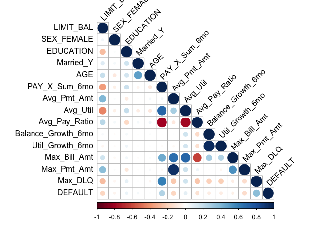
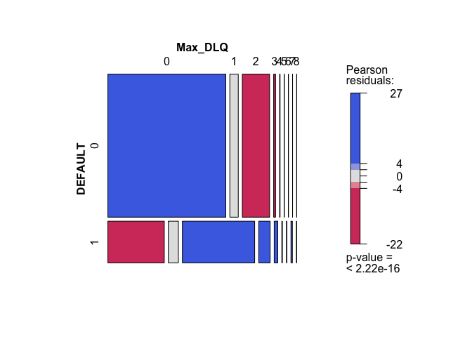
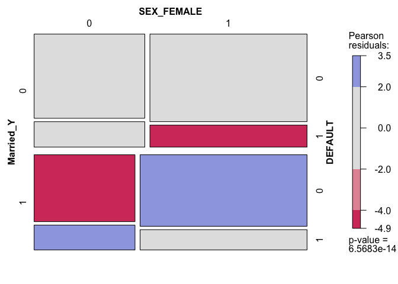
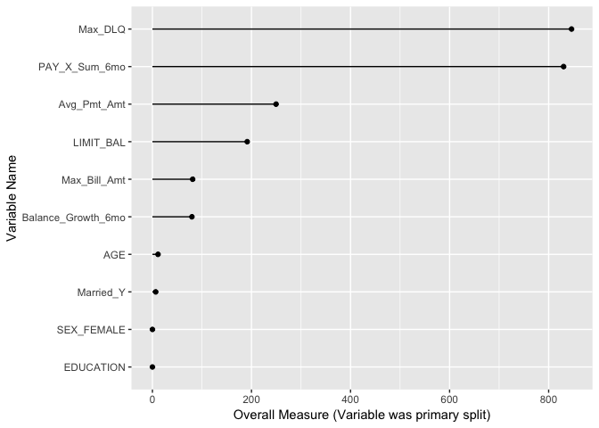
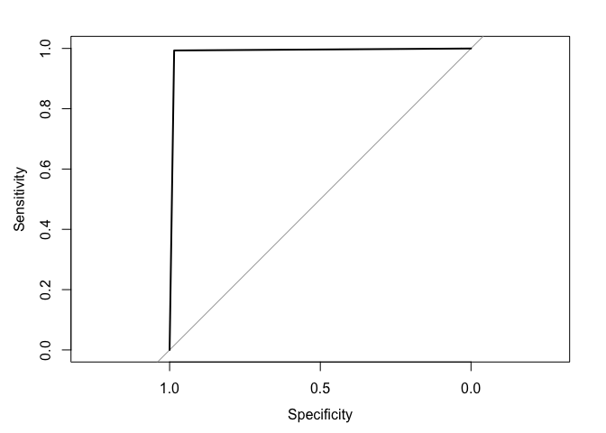
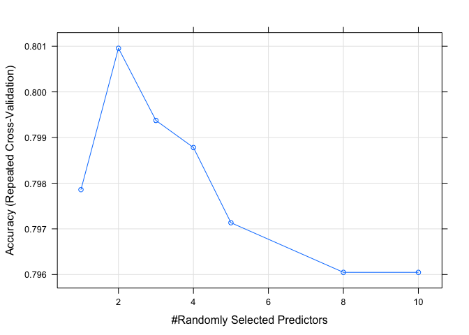
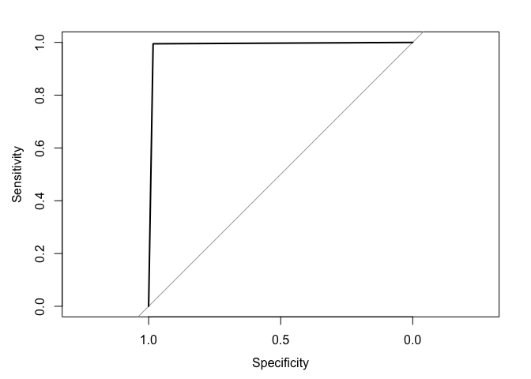
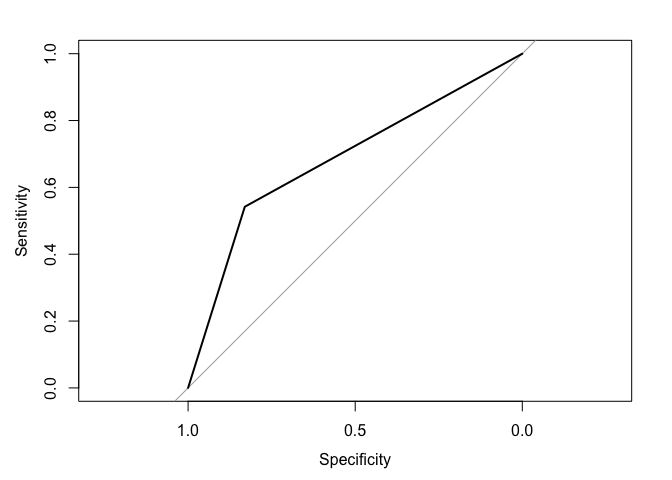
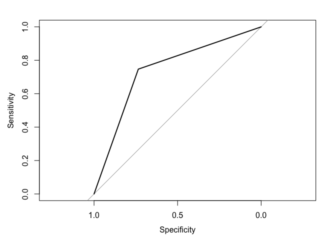
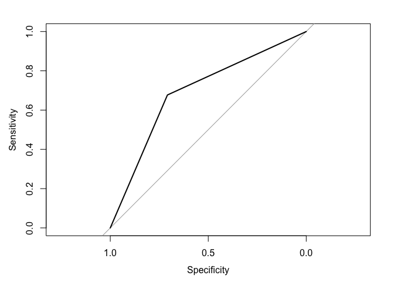

Credit Problem - Random Forest & Boosting
================
Daniel Macdonald @talentrics
5/26/2019

### Project Description

This notebook is the second of 3 published for my [MSDS Capstone
Project](https://sps.northwestern.edu/masters/data-science/curriculum-specializations.php)
at Northwestern University.  
The objective of this project is to demonstrate core MSDS programming
and data analysis skills.

These notebooks support analysis published in the [Summary: Model
Development Guide
(PDF)](https://github.com/talentrics/MSDS_Capstone_Project/blob/master/Credit_Problem_4_Model_Development_Guide.pdf)

**Below is a summary of the notebooks published in relation to this
project:**  
\* [EDA & Data
Transformation](https://github.com/talentrics/MSDS_Capstone_Project/blob/master/Credit_Problem_1_EDA.md)  
\* [Random Forest and Gradient Boosting
Analysis](https://github.com/talentrics/MSDS_Capstone_Project/blob/master/Credit_Problem_2_Tree_Models.md)
**(This Notebook)**  
\* [Regression and Principal Components
Analysis](https://github.com/talentrics/MSDS_Capstone_Project/blob/master/Credit_Problem_3_Regression_Models.md)

### Data Overview

  - Source: [‘Default of Credit Card Clients Data
    Set’](https://archive.ics.uci.edu/ml/datasets/default+of+credit+card+clients)
    on UCI Machine Learning Repository.  
  - The data were provided by a bank in Taiwan in 2016 for purposes of
    ‘default’ prediction.
  - The data are 30,000 individual customer observations with 30
    attributes.
  - Observations were over a six month period from April to September of
    2005.
  - Attributes = available credit, gender, age, marital status, & bill
    payment.
  - Response variable = ‘DEFAULT’ - did the customer default (1 = True).

This notebook summarizes two modelling techniques: Random Forest and
Gradient Boosting.  
EDA, Data Transformation, Linear modelling & PCA can be found in
notebooks linked above.

## Part 1 Data Overview

Data installed from RData file saved on local computer. The original
file can be foud in [github
repository/data.](https://github.com/talentrics/MSDS_Capstone_Project/blob/master/data/credit_card_default.RData)
Data Exploration and transformation is outlined in part 1 of this
project - [posted
here.](https://github.com/talentrics/MSDS_Capstone_Project/blob/master/Credit_Problem_1_EDA.md)

``` r
# Read the RData object using readRDS();
credit_card_default <- readRDS('/Users/talentrics/credit_card_default.RData')
#rename data set
raw.data <- credit_card_default
#update column name for 'PAY_0' to 'PAY_1'
colnames(raw.data)[which(colnames
    (raw.data) == 'PAY_0')] <- 'PAY_1'
```

### Data Transformation

\*variable transformation of demographic data\*\*

``` r
#transform SEX variable to SEX_FEMALE (1=true)
raw.data$SEX_FEMALE <- ifelse(raw.data$SEX == 2,1,0)

#transform MARRIED variable to Married_Y (1=true)
raw.data$Married_Y <- ifelse(raw.data$MARRIAGE == 1,1,0)

#transform EDUCATION variable so all above 3 are (0 = Other)
raw.data$EDUCATION[raw.data$EDUCATION > 3] <- 0
```

\*variable reduction of PAY\_X, BILL\_AMTX & PAY\_AMTX vatiables\*\*

``` r
#create sum variable of PAY_1 : PAY_6 variables
raw.data$PAY_X_Sum_6mo <- rowSums(cbind(raw.data$PAY_1,raw.data$PAY_2,
                                  raw.data$PAY_3,raw.data$PAY_4,
                                  raw.data$PAY_5,raw.data$PAY_6))

#create variable of max value of BILL_AMT1 : BILL_AMT6
raw.data$Max_Bill_Amt <- pmax(raw.data$BILL_AMT1,raw.data$BILL_AMT2,
                              raw.data$BILL_AMT3,raw.data$BILL_AMT4,
                              raw.data$BILL_AMT5,raw.data$BILL_AMT6)

#create variable of sum value of PAY_AMT1 : PAY_AMT6
raw.data$PMT_SUM <- rowSums(cbind(raw.data$PAY_AMT1,raw.data$PAY_AMT2,
                                  raw.data$PAY_AMT3,raw.data$PAY_AMT4,
                                  raw.data$PAY_AMT5,raw.data$PAY_AMT6))

#create variable of average of PAY_AMT1 : PAY_AMT6
raw.data$Avg_Pmt_Amt <- raw.data$PMT_SUM/6

## Create column Max_Pmt_Amt ##
raw.data$Max_Pmt_Amt <- pmax(raw.data$PAY_AMT1,raw.data$PAY_AMT2,
                                  raw.data$PAY_AMT3,raw.data$PAY_AMT4,
                                  raw.data$PAY_AMT5,raw.data$PAY_AMT6)
```

**AVG\_Util - variable creation (Utilization =
BILL\_AMT/LIMIT\_BAL)**

``` r
#find utilization rate of each billing cycle (Utilization = BILL_AMT/LIMIT_BAL)
raw.data$Util_Bill_1 <- raw.data$BILL_AMT1 / raw.data$LIMIT_BAL
raw.data$Util_Bill_2 <- raw.data$BILL_AMT2 / raw.data$LIMIT_BAL
raw.data$Util_Bill_3 <- raw.data$BILL_AMT3 / raw.data$LIMIT_BAL
raw.data$Util_Bill_4 <- raw.data$BILL_AMT4 / raw.data$LIMIT_BAL
raw.data$Util_Bill_5 <- raw.data$BILL_AMT5 / raw.data$LIMIT_BAL
raw.data$Util_Bill_6 <- raw.data$BILL_AMT6 / raw.data$LIMIT_BAL

#create variable of sum values of utilization rates Util_Bill_1 : Util_Bill_6
raw.data$Util_SUM = rowSums(cbind(raw.data$Util_Bill_1,raw.data$Util_Bill_2,
                            raw.data$Util_Bill_3,raw.data$Util_Bill_4,
                            raw.data$Util_Bill_5,raw.data$Util_Bill_6))

#take the average Utilization rate from Util_Bill_1 : Util_Bill_6
raw.data$Avg_Util <- raw.data$Util_SUM/6
```

**Avg\_Pay\_Ratio - variable creation (Pay\_Ratio =
BILL\_AMTX/PAY\_AMTX-1)**

``` r
## NOTE: PAY_AMT1 is lagging payment on BILL_AMT2 (only 5 measures) ##
raw.data$Pay_Ratio_1 <- ifelse(raw.data$BILL_AMT2 > 0,
                               (raw.data$PAY_AMT1 / raw.data$BILL_AMT2),1)
raw.data$Pay_Ratio_2 <- ifelse(raw.data$BILL_AMT3 > 0,
                               (raw.data$PAY_AMT2 / raw.data$BILL_AMT3),1)
raw.data$Pay_Ratio_3 <- ifelse(raw.data$BILL_AMT4 > 0,
                               (raw.data$PAY_AMT3 / raw.data$BILL_AMT4),1)
raw.data$Pay_Ratio_4 <- ifelse(raw.data$BILL_AMT5 > 0,
                               (raw.data$PAY_AMT4 / raw.data$BILL_AMT5),1)
raw.data$Pay_Ratio_5 <- ifelse(raw.data$BILL_AMT6 > 0,
                               (raw.data$PAY_AMT5 / raw.data$BILL_AMT6),1)

raw.data$Ratio_SUM = rowSums(cbind(raw.data$Pay_Ratio_1,raw.data$Pay_Ratio_2,
                             raw.data$Pay_Ratio_3,raw.data$Pay_Ratio_4,
                             raw.data$Pay_Ratio_5))

raw.data$Avg_Pay_Ratio <- raw.data$Ratio_SUM/5
```

**Max\_DLQ - variable creation (max value of PAY\_1 : PAY\_6)**

``` r
#find max value of variables PAY_1 : PAY_6
raw.data$Max_DLQa <- pmax(raw.data$PAY_1,raw.data$PAY_2,raw.data$PAY_3,
                          raw.data$PAY_4,raw.data$PAY_5,raw.data$PAY_6)

#if Max_DLQa is below zero, set to zero, else max value of Max_DLQa
raw.data$Max_DLQ <- ifelse(raw.data$Max_DLQa <= 0,0,raw.data$Max_DLQa)
```

**Balance\_Growth\_6mo - variable creation (∆ in difference from
LIMIT\_BAL to BILL\_AMT over time)**

``` r
raw.data$Balance_Growth_6mo <- (raw.data$LIMIT_BAL-raw.data$BILL_AMT6)-
                          (raw.data$LIMIT_BAL-raw.data$BILL_AMT1)
```

**Util\_Growth\_6mo - variable creation (∆ in utilization Util\_Bill\_1
- Util\_Bill\_6)**

``` r
raw.data$Util_Growth_6mo <- raw.data$Util_Bill_1 - raw.data$Util_Bill_6
```

**target - transform response variable ‘DEFAULT’ into factor**

``` r
raw.data$target <- as.factor(raw.data$DEFAULT)
```

**initial data set for ‘tree’ type models using continuous variables**

``` r
sub_list_RF1 <- c("LIMIT_BAL","SEX_FEMALE","EDUCATION",
               "Married_Y","AGE","PAY_X_Sum_6mo","Avg_Pmt_Amt","Avg_Util","Avg_Pay_Ratio",
               "Balance_Growth_6mo","Util_Growth_6mo","Max_Bill_Amt","Max_Pmt_Amt",
               "Max_DLQ","DEFAULT")

xtrain_RF1 <- subset(raw.data, select = sub_list_RF1, data.group == 1)
xtest_RF1 <- subset(raw.data, select = sub_list_RF1, data.group == 2)
validate_RF1 <- subset(raw.data, select = sub_list_RF1, data.group == 3)

str(xtrain_RF1)
```

    ## 'data.frame':    15180 obs. of  15 variables:
    ##  $ LIMIT_BAL         : int  20000 90000 50000 20000 260000 250000 20000 320000 360000 50000 ...
    ##  $ SEX_FEMALE        : num  1 1 0 0 1 0 0 0 1 1 ...
    ##  $ EDUCATION         : num  2 2 1 3 1 1 1 1 1 3 ...
    ##  $ Married_Y         : num  1 0 0 0 0 0 0 1 1 1 ...
    ##  $ AGE               : int  24 34 37 35 51 29 24 49 49 47 ...
    ##  $ PAY_X_Sum_6mo     : num  -2 0 0 -10 -3 0 8 -3 -9 -6 ...
    ##  $ Avg_Pmt_Amt       : num  115 1836 1295 2355 11051 ...
    ##  $ Avg_Util          : num  0.0642 0.1882 0.7937 0.2243 0.0566 ...
    ##  $ Avg_Pay_Ratio     : num  0.8 0.084 0.042 0.816 0.803 ...
    ##  $ Balance_Growth_6mo: int  3913 13690 44376 -13912 -1407 15375 -3728 57687 0 393 ...
    ##  $ Util_Growth_6mo   : num  0.19565 0.15211 0.88752 -0.6956 -0.00541 ...
    ##  $ Max_Bill_Amt      : int  3913 29239 64400 13912 22287 70887 19104 253286 0 30430 ...
    ##  $ Max_Pmt_Amt       : int  689 5000 2500 13007 22301 3000 3200 195599 0 30430 ...
    ##  $ Max_DLQ           : num  2 0 0 0 2 0 2 0 1 0 ...
    ##  $ DEFAULT           : int  1 0 0 0 0 0 1 0 0 0 ...

## Correlation Check & final variable selection:

``` r
#install.packages("corrplot")
library(corrplot)
```

``` r
data.cor = cor(xtrain_RF1, method = c("spearman"))
corrplot(data.cor, type = "lower", tl.col = "black", tl.srt = 45)
```

<!-- -->

``` r
# check correlation of BILL_X Sum Variable
Train_RF1.correlation <- cor(raw.data[,sub_list_RF1])
Train_RF1.correlation <- as.data.frame(Train_RF1.correlation)
Train_RF1.correlation <- Train_RF1.correlation[15]
Train_RF1.correlation$Variables <- row.names(Train_RF1.correlation)
Train_RF1.correlation <- Train_RF1.correlation[,c("Variables","DEFAULT")]
Train_RF1.correlation <- Train_RF1.correlation[order(Train_RF1.correlation$DEFAULT),]
row.names(Train_RF1.correlation) <- NULL
Train_RF1.correlation
```

    ##             Variables      DEFAULT
    ## 1           LIMIT_BAL -0.153519876
    ## 2         Avg_Pmt_Amt -0.102354388
    ## 3         Max_Pmt_Amt -0.081840594
    ## 4        Max_Bill_Amt -0.040913273
    ## 5          SEX_FEMALE -0.039960578
    ## 6  Balance_Growth_6mo -0.025649176
    ## 7     Util_Growth_6mo -0.023711705
    ## 8       Avg_Pay_Ratio -0.005771636
    ## 9                 AGE  0.013889834
    ## 10          Married_Y  0.029774610
    ## 11          EDUCATION  0.065684521
    ## 12           Avg_Util  0.115482853
    ## 13      PAY_X_Sum_6mo  0.281954577
    ## 14            Max_DLQ  0.370388054
    ## 15            DEFAULT  1.000000000

``` r
library(vcd)
mosaic(~ DEFAULT + Max_DLQ, 
       data = xtrain_RF1, shade=TRUE, legend=TRUE)
```

<!-- -->

``` r
mosaic(~ SEX_FEMALE + DEFAULT | Married_Y, 
       data = xtrain_RF1, shade=TRUE, legend=TRUE)
```

<!-- -->

``` r
raw.data$target <- as.factor(raw.data$DEFAULT)

sub_list_RFb <- c("LIMIT_BAL","SEX_FEMALE","EDUCATION",
               "Married_Y","AGE","PAY_X_Sum_6mo","Avg_Pmt_Amt",
               "Balance_Growth_6mo","Max_Bill_Amt","Max_DLQ","target")

xtrain_RF1 <- subset(raw.data, select = sub_list_RFb, data.group == 1)
xtest_RF1 <- subset(raw.data, select = sub_list_RFb, data.group == 2)
validate_RF1 <- subset(raw.data, select = sub_list_RFb, data.group == 3)

str(xtrain_RF1)
```

    ## 'data.frame':    15180 obs. of  11 variables:
    ##  $ LIMIT_BAL         : int  20000 90000 50000 20000 260000 250000 20000 320000 360000 50000 ...
    ##  $ SEX_FEMALE        : num  1 1 0 0 1 0 0 0 1 1 ...
    ##  $ EDUCATION         : num  2 2 1 3 1 1 1 1 1 3 ...
    ##  $ Married_Y         : num  1 0 0 0 0 0 0 1 1 1 ...
    ##  $ AGE               : int  24 34 37 35 51 29 24 49 49 47 ...
    ##  $ PAY_X_Sum_6mo     : num  -2 0 0 -10 -3 0 8 -3 -9 -6 ...
    ##  $ Avg_Pmt_Amt       : num  115 1836 1295 2355 11051 ...
    ##  $ Balance_Growth_6mo: int  3913 13690 44376 -13912 -1407 15375 -3728 57687 0 393 ...
    ##  $ Max_Bill_Amt      : int  3913 29239 64400 13912 22287 70887 19104 253286 0 30430 ...
    ##  $ Max_DLQ           : num  2 0 0 0 2 0 2 0 1 0 ...
    ##  $ target            : Factor w/ 2 levels "0","1": 2 1 1 1 1 1 2 1 1 1 ...

``` r
library(rpart)
library(rpart.plot)

fit <- rpart(target ~ .,data=xtrain_RF1,
             control=rpart.control(minsplit=800,minbucket = 15,cp=0.001))
```

``` r
library(caret)
```

    ## Warning: package 'caret' was built under R version 3.5.2

    ## Loading required package: lattice

    ## Loading required package: ggplot2

``` r
importance <- varImp(fit)
importance_t <- as.data.frame(importance)
importance_t$Variables <- row.names(importance_t)
importance_t <- importance_t[,c("Variables","Overall")]
importance_t <- importance_t[order(-importance_t$Overall),]
row.names(importance_t) <- NULL
importance_t
```

    ##             Variables    Overall
    ## 1             Max_DLQ 846.231644
    ## 2       PAY_X_Sum_6mo 830.204881
    ## 3         Avg_Pmt_Amt 249.640350
    ## 4           LIMIT_BAL 191.355947
    ## 5        Max_Bill_Amt  81.230178
    ## 6  Balance_Growth_6mo  79.717194
    ## 7                 AGE  11.303759
    ## 8           Married_Y   6.614189
    ## 9          SEX_FEMALE   0.000000
    ## 10          EDUCATION   0.000000

``` r
library(ggplot2)
ggplot(importance_t, aes(x=reorder(Variables, Overall), y=Overall)) + 
  geom_point() +
  geom_segment(aes(x=Variables,xend=Variables,y=0,yend=Overall)) +
  #scale_color_discrete(name="Variable Group") +
  ylab("Overall Measure (Variable was primary split)") +
  xlab("Variable Name") +
  coord_flip()
```

<!-- -->

``` r
#install.packages("randomForest")
library(caret)
#install.packages("tidyverse")
library(tidyverse)
library(pROC)
```

**Random Forest Model**

``` r
fit.rf <- train(target ~ .,data = xtrain_RF1,method = "rf")
```

``` r
# Predicting probability of survival using predict type 'prob'
predRF1_prob <- predict(fit.rf, newdata = xtrain_RF1, type = "prob")

#create column with likelihood factor
xtrain_RF1$predRF1_prob <- abs(as.numeric(predRF1_prob$'1'))
summary(xtrain_RF1$predRF1_prob)
```

    ##    Min. 1st Qu.  Median    Mean 3rd Qu.    Max. 
    ##  0.0000  0.0280  0.0660  0.2074  0.2600  0.9960

``` r
#create binary classifier based on threshold values
xtrain_RF1$classes <- ifelse(xtrain_RF1$predRF1_prob >.3,1,0)

# Checking classification accuracy
RF1_train = table(xtrain_RF1$target,xtrain_RF1$classes) 
RF1_train
```

    ##    
    ##         0     1
    ##   0 11578   179
    ##   1    23  3400

``` r
# Checking classification accuracy
t_RF1_train = table(xtrain_RF1$target,xtrain_RF1$classes) 
t_RF1_train
```

    ##    
    ##         0     1
    ##   0 11578   179
    ##   1    23  3400

``` r
accuracy.RF1_train <- (t_RF1_train[1,1]+t_RF1_train[2,2])/(t_RF1_train[1,1]+
                          t_RF1_train[1,2]+t_RF1_train[2,1]+t_RF1_train[2,2])

# Compute row totals;
r_RF1_train <- apply(t_RF1_train,MARGIN=1,FUN=sum);
# Normalize confusion matrix to rates;
matrix_RF1_train <- t_RF1_train/r_RF1_train
matrix_RF1_train
```

    ##    
    ##               0           1
    ##   0 0.984775028 0.015224972
    ##   1 0.006719252 0.993280748

``` r
cat('RF1_train accuracy:',accuracy.RF1_train)
```

    ## RF1_train accuracy: 0.986693

``` r
rf.roc1 <-roc(xtrain_RF1$target,xtrain_RF1$classes)
plot(rf.roc1)
```

<!-- -->

``` r
auc(rf.roc1)
```

    ## Area under the curve: 0.989

``` r
### Predicting on test set  ##
predRF1_test <- predict(fit.rf, xtest_RF1, type = "prob")
xtest_RF1$predRF1_num <- abs(as.numeric(predRF1_test$`1`))
xtest_RF1$classes <- ifelse(xtest_RF1$predRF1_num >.25,1,0)

# Checking classification accuracy
t_RF1_test = table(xtest_RF1$target,xtest_RF1$classes) 
t_RF1_test
```

    ##    
    ##        0    1
    ##   0 4510 1256
    ##   1  612  945

``` r
accuracy.RF1_test <- (t_RF1_test[1,1]+t_RF1_test[2,2])/(t_RF1_test[1,1]+
                          t_RF1_test[1,2]+t_RF1_test[2,1]+t_RF1_test[2,2])

# Compute row totals;
r_RF1_test <- apply(t_RF1_test,MARGIN=1,FUN=sum);
# Normalize confusion matrix to rates;
matrix_RF1_test <- t_RF1_test/r_RF1_test
matrix_RF1_test
```

    ##    
    ##             0         1
    ##   0 0.7821713 0.2178287
    ##   1 0.3930636 0.6069364

``` r
cat('RF1_test accuracy:',accuracy.RF1_test)
```

    ## RF1_test accuracy: 0.7449133

``` r
sub_list_RFc <- c("LIMIT_BAL","SEX_FEMALE","EDUCATION",
               "Married_Y","AGE","PAY_X_Sum_6mo","Avg_Pmt_Amt",
               "Balance_Growth_6mo","Max_Bill_Amt","Max_DLQ","target")

xtrain_RF2 <- subset(raw.data, select = sub_list_RFc, data.group == 1)
xtest_RF2 <- subset(raw.data, select = sub_list_RFc, data.group == 2)
validate_RF2 <- subset(raw.data, select = sub_list_RFc, data.group == 3)

str(xtrain_RF2)
```

    ## 'data.frame':    15180 obs. of  11 variables:
    ##  $ LIMIT_BAL         : int  20000 90000 50000 20000 260000 250000 20000 320000 360000 50000 ...
    ##  $ SEX_FEMALE        : num  1 1 0 0 1 0 0 0 1 1 ...
    ##  $ EDUCATION         : num  2 2 1 3 1 1 1 1 1 3 ...
    ##  $ Married_Y         : num  1 0 0 0 0 0 0 1 1 1 ...
    ##  $ AGE               : int  24 34 37 35 51 29 24 49 49 47 ...
    ##  $ PAY_X_Sum_6mo     : num  -2 0 0 -10 -3 0 8 -3 -9 -6 ...
    ##  $ Avg_Pmt_Amt       : num  115 1836 1295 2355 11051 ...
    ##  $ Balance_Growth_6mo: int  3913 13690 44376 -13912 -1407 15375 -3728 57687 0 393 ...
    ##  $ Max_Bill_Amt      : int  3913 29239 64400 13912 22287 70887 19104 253286 0 30430 ...
    ##  $ Max_DLQ           : num  2 0 0 0 2 0 2 0 1 0 ...
    ##  $ target            : Factor w/ 2 levels "0","1": 2 1 1 1 1 1 2 1 1 1 ...

**control RF devleopment to limit over training**

``` r
# Random Search
control <- trainControl(method="repeatedcv", number=10, repeats=2, search="random")
seed <- 7
set.seed(seed)
metric = "Accuracy"
ntree = 500
mtry <- 5
rf_random <- train(target ~., data=xtrain_RF2, method="rf", 
                   metric=metric, tuneLength=10,trControl=control)
print(rf_random)
```

    ## Random Forest 
    ## 
    ## 15180 samples
    ##    10 predictor
    ##     2 classes: '0', '1' 
    ## 
    ## No pre-processing
    ## Resampling: Cross-Validated (10 fold, repeated 2 times) 
    ## Summary of sample sizes: 13662, 13661, 13661, 13662, 13663, 13662, ... 
    ## Resampling results across tuning parameters:
    ## 
    ##   mtry  Accuracy   Kappa    
    ##    1    0.7978589  0.2271378
    ##    2    0.8009551  0.3094103
    ##    3    0.7993738  0.3162582
    ##    4    0.7987810  0.3174246
    ##    5    0.7971342  0.3153052
    ##    8    0.7960476  0.3155304
    ##   10    0.7960473  0.3140923
    ## 
    ## Accuracy was used to select the optimal model using the largest value.
    ## The final value used for the model was mtry = 2.

``` r
plot(rf_random)
```

<!-- -->

## model RF2

``` r
seed <- 7
set.seed(seed)
fit.rf2 <- train(target ~ .,data = xtrain_RF2,method = "rf",tuneLength=2,trControl=control)
```

``` r
# Predicting probability of survival using predict type 'prob'
predRF2_prob <- predict(fit.rf2, newdata = xtrain_RF2, type = "prob")

#create column with likelihood factor
xtrain_RF2$predRF2_prob <- abs(as.numeric(predRF2_prob$'1'))
summary(xtrain_RF2$predRF2_prob)
```

    ##    Min. 1st Qu.  Median    Mean 3rd Qu.    Max. 
    ##  0.0000  0.0280  0.0660  0.2075  0.2605  0.9980

``` r
#create binary classifier based on threshold values
xtrain_RF2$classes <- ifelse(xtrain_RF2$predRF2_prob >.3,1,0)

# Checking classification accuracy
t_RF2_train = table(xtrain_RF2$target,xtrain_RF2$classes) 
t_RF2_train
```

    ##    
    ##         0     1
    ##   0 11556   201
    ##   1    18  3405

``` r
accuracy.RF2_train <- (t_RF2_train[1,1]+t_RF2_train[2,2])/(t_RF2_train[1,1]+
                          t_RF2_train[1,2]+t_RF2_train[2,1]+t_RF2_train[2,2])

# Compute row totals;
r_RF2_train <- apply(t_RF2_train,MARGIN=1,FUN=sum);
# Normalize confusion matrix to rates;
matrix_RF2_train <- t_RF2_train/r_RF2_train
matrix_RF2_train
```

    ##    
    ##               0           1
    ##   0 0.982903802 0.017096198
    ##   1 0.005258545 0.994741455

``` r
cat('RF2_train accuracy:',accuracy.RF2_train)
```

    ## RF2_train accuracy: 0.9855731

``` r
rf.roc2 <-roc(xtrain_RF2$target,xtrain_RF2$classes)
plot(rf.roc2)
```

<!-- -->

``` r
auc(rf.roc2)
```

    ## Area under the curve: 0.9888

``` r
### Predicting on test set  ##
predRF2_test <- predict(fit.rf2, xtest_RF2, type = "prob")
xtest_RF2$predRF2_num <- abs(as.numeric(predRF2_test$`1`))
xtest_RF2$classes <- ifelse(xtest_RF2$predRF2_num >.3,1,0)

# Checking classification accuracy
t_RF2_test = table(xtest_RF2$target,xtest_RF2$classes) 
t_RF2_test
```

    ##    
    ##        0    1
    ##   0 4787  979
    ##   1  713  844

``` r
accuracy.RF2_test <- (t_RF2_test[1,1]+t_RF2_test[2,2])/(t_RF2_test[1,1]+
                          t_RF2_test[1,2]+t_RF2_test[2,1]+t_RF2_test[2,2])

# Compute row totals;
r_RF2_test <- apply(t_RF2_test,MARGIN=1,FUN=sum);
# Normalize confusion matrix to rates;
matrix_RF2_test <- t_RF2_test/r_RF2_test
matrix_RF2_test
```

    ##    
    ##             0         1
    ##   0 0.8302116 0.1697884
    ##   1 0.4579319 0.5420681

``` r
cat('RF2_test accuracy:',accuracy.RF2_test)
```

    ## RF2_test accuracy: 0.7689472

``` r
rf.roc2_test <-roc(xtest_RF2$target,xtest_RF2$classes)
plot(rf.roc2_test)
```

<!-- -->

``` r
auc(rf.roc2_test)
```

    ## Area under the curve: 0.6861

## Gradient Boosting method

**set up train/test/validate data**

``` r
sub_list_GBM <- c("LIMIT_BAL","SEX_FEMALE","EDUCATION",
               "Married_Y","AGE","PAY_X_Sum_6mo","Avg_Pmt_Amt",
               "Balance_Growth_6mo","Max_Bill_Amt","Max_DLQ","target")

xtrain_GBM <- subset(raw.data, select = sub_list_GBM, data.group == 1)
xtest_GBM <- subset(raw.data, select = sub_list_GBM, data.group == 2)
validate_GBM <- subset(raw.data, select = sub_list_GBM, data.group == 3)
str(xtrain_GBM)
```

    ## 'data.frame':    15180 obs. of  11 variables:
    ##  $ LIMIT_BAL         : int  20000 90000 50000 20000 260000 250000 20000 320000 360000 50000 ...
    ##  $ SEX_FEMALE        : num  1 1 0 0 1 0 0 0 1 1 ...
    ##  $ EDUCATION         : num  2 2 1 3 1 1 1 1 1 3 ...
    ##  $ Married_Y         : num  1 0 0 0 0 0 0 1 1 1 ...
    ##  $ AGE               : int  24 34 37 35 51 29 24 49 49 47 ...
    ##  $ PAY_X_Sum_6mo     : num  -2 0 0 -10 -3 0 8 -3 -9 -6 ...
    ##  $ Avg_Pmt_Amt       : num  115 1836 1295 2355 11051 ...
    ##  $ Balance_Growth_6mo: int  3913 13690 44376 -13912 -1407 15375 -3728 57687 0 393 ...
    ##  $ Max_Bill_Amt      : int  3913 29239 64400 13912 22287 70887 19104 253286 0 30430 ...
    ##  $ Max_DLQ           : num  2 0 0 0 2 0 2 0 1 0 ...
    ##  $ target            : Factor w/ 2 levels "0","1": 2 1 1 1 1 1 2 1 1 1 ...

``` r
control <- trainControl(method="repeatedcv", number=10, repeats=2, search="random")

GBM <- train(target ~ ., data = xtrain_GBM, 
                 method = "gbm", tuneLength=2,
                 trControl = control,
                 ## This last option is actually one
                 ## for gbm() that passes through
                 verbose = FALSE)
```

**measure train accuracy**

``` r
# Predicting on training set

predGBM_prob <- predict(GBM, newdata = xtrain_GBM,type ="prob")

#create column with likelihood factor
xtrain_GBM$predGBM_num <- abs(as.numeric(predGBM_prob$`1`))
#create binary classifier based on threshold values
xtrain_GBM$classes <- ifelse(xtrain_GBM$predGBM_num >.2,1,0)
#create roc curve
roc_GBM_train <-roc(xtrain_GBM$target,xtrain_GBM$classes)

plot(roc_GBM_train)
```

<!-- -->

``` r
auc(roc_GBM_train)
```

    ## Area under the curve: 0.741

``` r
# Checking classification accuracy
t_GBM_train = table(xtrain_GBM$target,xtrain_GBM$classes) 
t_GBM_train
```

    ##    
    ##        0    1
    ##   0 8641 3116
    ##   1  866 2557

``` r
accuracy.GBM_train <- (t_GBM_train[1,1]+t_GBM_train[2,2])/(t_GBM_train[1,1]+
                      t_GBM_train[1,2]+t_GBM_train[2,1]+t_GBM_train[2,2])

accuracy.GBM_train
```

    ## [1] 0.7376812

``` r
# Compute row totals;
r_GBM_train <- apply(t_GBM_train,MARGIN=1,FUN=sum);
# Normalize confusion matrix to rates;
matrix_GBM_train <- t_GBM_train/r_GBM_train
matrix_GBM_train
```

    ##    
    ##             0         1
    ##   0 0.7349664 0.2650336
    ##   1 0.2529944 0.7470056

``` r
cat('GBM_train accuracy:',accuracy.GBM_train)
```

    ## GBM_train accuracy: 0.7376812

``` r
### Predicting on test set  ##
predGBM_test <- predict(GBM, xtest_GBM, type = "prob")

xtest_GBM$predGBM_num <- abs(as.numeric(predGBM_test$`1`))
xtest_GBM$classes <- ifelse(xtest_GBM$predGBM_num >.2,1,0)

#create roc curve
roc_GBM_test <-roc(xtest_GBM$target,xtest_GBM$classes)

plot(roc_GBM_test)
```

<!-- -->

``` r
auc(roc_GBM_test)
```

    ## Area under the curve: 0.6926

``` r
# Checking classification accuracy
t_GBM_test = table(xtest_GBM$target,xtest_GBM$classes) 
t_GBM_test
```

    ##    
    ##        0    1
    ##   0 4084 1682
    ##   1  503 1054

``` r
accuracy.GBM_test <- (t_GBM_test[1,1]+t_GBM_test[2,2])/(t_GBM_test[1,1]+
                          t_GBM_test[1,2]+t_GBM_test[2,1]+t_GBM_test[2,2])

accuracy.GBM_test
```

    ## [1] 0.701625

``` r
# Compute row totals;
r_GBM_test <- apply(t_GBM_test,MARGIN=1,FUN=sum);
# Normalize confusion matrix to rates;
matrix_GBM_test <- t_GBM_test/r_GBM_test
matrix_GBM_test
```

    ##    
    ##             0         1
    ##   0 0.7082900 0.2917100
    ##   1 0.3230572 0.6769428

These notebooks support analysis published in the [Summary: Model
Development Guide
(PDF)](https://github.com/talentrics/MSDS_Capstone_Project/blob/master/Credit_Problem_4_Model_Development_Guide.pdf)

**Below is a summary of the notebooks published in relation to this
project:**  
\* [EDA & Data
Transformation](https://github.com/talentrics/MSDS_Capstone_Project/blob/master/Credit_Problem_1_EDA.md)  
\* [Random Forest and Gradient Boosting
Analysis](https://github.com/talentrics/MSDS_Capstone_Project/blob/master/Credit_Problem_2_Tree_Models.md)
**(This Notebook)**  
\* [Regression and Principal Components
Analysis](https://github.com/talentrics/MSDS_Capstone_Project/blob/master/Credit_Problem_3_Regression_Models.md)
