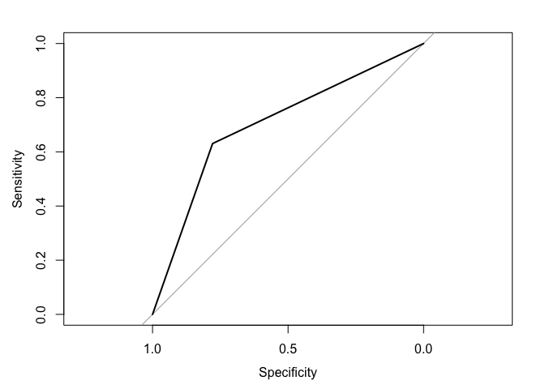
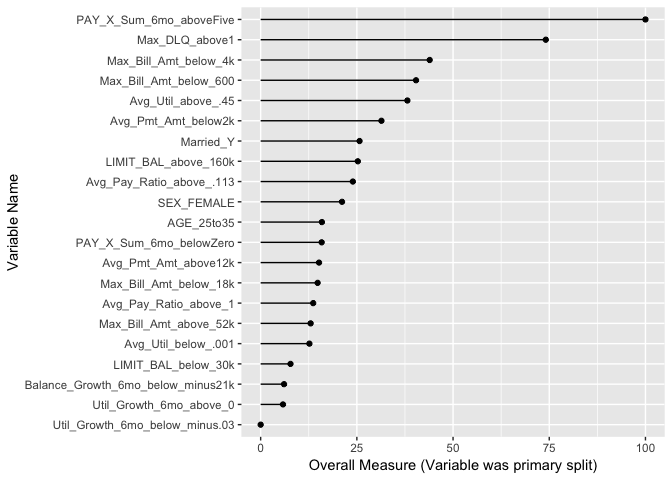
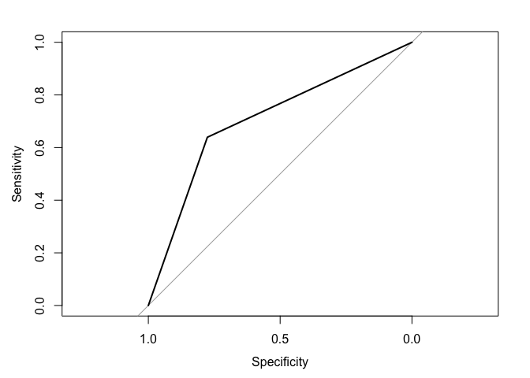
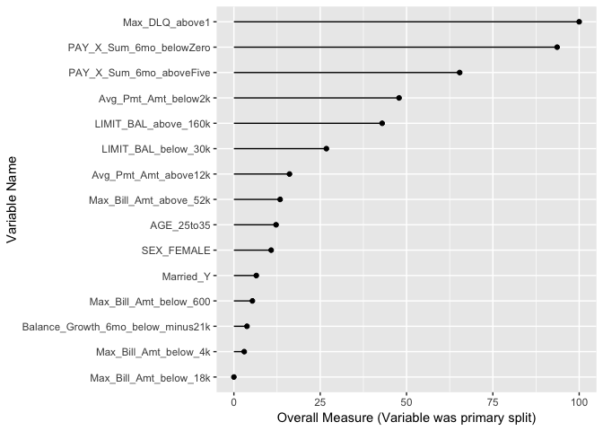

Credit Problem - Regression & PCA
================
Daniel Macdonald @talentrics
5/28/2019

### Project Description

This notebook is the third of 3 published for my [MSDS Capstone
Project](https://sps.northwestern.edu/masters/data-science/curriculum-specializations.php)
at Northwestern University.  
The objective of this project is to demonstrate core MSDS programming
and data analysis skills.

These notebooks support analysis published in the [Summary: Model
Development Guide
(PDF)](https://github.com/talentrics/MSDS_Capstone_Project/blob/master/Credit_Problem_4_Model_Development_Guide.pdf)

**Below is a summary of the notebooks published in relation to this
project:**  
\* [EDA & Data
Transformation](https://github.com/talentrics/MSDS_Capstone_Project/blob/master/Credit_Problem_1_EDA.md)  
\* [Random Forest and Gradient Boosting
Analysis](https://github.com/talentrics/MSDS_Capstone_Project/blob/master/Credit_Problem_2_Tree_Models.md)  
\* [Regression and Principal Components
Analysis](https://github.com/talentrics/MSDS_Capstone_Project/blob/master/Credit_Problem_3_Regression_Models.md)
**(This Notebook)**

### Data Overview

  - Source: [‘Default of Credit Card Clients Data
    Set’](https://archive.ics.uci.edu/ml/datasets/default+of+credit+card+clients)
    on UCI Machine Learning Repository.  
  - The data were provided by a bank in Taiwan in 2016 for purposes of
    ‘default’ prediction.
  - The data are 30,000 individual customer observations with 30
    attributes.
  - Observations were over a six month period from April to September of
    2005.
  - Attributes = available credit, gender, age, marital status, & bill
    payment.
  - Response variable = ‘DEFAULT’ - did the customer default (1 = True).

This notebook summarizes two modelling techniques: Logistic Regression
and Principal Component Analysis (PCANNet)  
EDA, Data Transformation, Linear modelling & PCA can be found in
notebooks linked above.

## Data Transformation

Data installed from RData file saved on local computer. The original
file can be foud in [github
repository/data.](https://github.com/talentrics/MSDS_Capstone_Project/blob/master/data/credit_card_default.RData)  
Data Exploration and transformation is outlined in part 1 of this
project - [posted
here.](https://github.com/talentrics/MSDS_Capstone_Project/blob/master/Credit_Problem_1_EDA.md)

``` r
# Read the RData object using readRDS();
credit_card_default <- readRDS('/Users/talentrics/credit_card_default.RData')
#rename data set
raw.data <- credit_card_default
#update column name for 'PAY_0' to 'PAY_1'
colnames(raw.data)[which(colnames
    (raw.data) == 'PAY_0')] <- 'PAY_1'
```

**LIMIT\_BAL - binned as per Weight of Evidence (WOE) analysis in data
exploration**

``` r
#transform LIMIT_BAL as per optimal binning in Exploratory Data Analysis (EDA)
raw.data$LIMIT_BAL_below_30k <- ifelse(raw.data$LIMIT_BAL <= 30000,1,0)
raw.data$LIMIT_BAL_above_160k <- ifelse(raw.data$LIMIT_BAL > 160000,1,0)
```

**Demographic data - SEX, MARRIAGE, & EDUCATION**

``` r
#transform SEX variable to SEX_FEMALE (1=true)
raw.data$SEX_FEMALE <- ifelse(raw.data$SEX == 2,1,0)

#transform MARRIED variable to Married_Y (1=true)
raw.data$Married_Y <- ifelse(raw.data$MARRIAGE == 1,1,0)

#transform EDUCATION variable so all above 3 are (0 = Other)
raw.data$EDUCATION[raw.data$EDUCATION > 3] <- 0
```

**ED\_Grad\_Other - binned as per Weight of Evidence (WOE) analysis in
data
exploration**

``` r
#transform EDUCATION as per optimal binning in Exploratory Data Analysis (EDA)
raw.data$ED_Grad_other <- ifelse((raw.data$EDUCATION < 1) | 
                             (raw.data$EDUCATION > 3) |(raw.data$EDUCATION == 1),1,0)
```

**AGE - binned as per Weight of Evidence (WOE) analysis in data
exploration**

``` r
#transform AGE as per optimal binning in Exploratory Data Analysis (EDA)
raw.data$AGE_below_25 <- ifelse(raw.data$AGE <= 25,1,0)
raw.data$AGE_25to35 <- ifelse((raw.data$AGE > 25) &
                                (raw.data$AGE <=35),1,0)
raw.data$AGE_above_40 <- ifelse(raw.data$AGE > 40,1,0)
```

**PAY\_X\_Sum\_6mo - binned as per Weight of Evidence (WOE) analysis in
data exploration**

``` r
#create sum variable of PAY_1 : PAY_6 variables
raw.data$PAY_X_Sum_6mo <- rowSums(cbind(raw.data$PAY_1,raw.data$PAY_2,
                                  raw.data$PAY_3,raw.data$PAY_4,
                                  raw.data$PAY_5,raw.data$PAY_6))

# bin the PAY_X_Sum_6mo as per optimal binning in Exploratory Data Analysis (EDA)
raw.data$PAY_X_Sum_6mo_belowZero <- ifelse(raw.data$PAY_X_Sum_6mo <= 0,1,0)
raw.data$PAY_X_Sum_6mo_aboveFive <- ifelse(raw.data$PAY_X_Sum_6mo > 5,1,0)
```

**Max\_Bill\_Amt - binned as per Weight of Evidence (WOE) analysis in
data exploration**

``` r
#create variable of max value of BILL_AMT1 : BILL_AMT6
raw.data$Max_Bill_Amt <- pmax(raw.data$BILL_AMT1,raw.data$BILL_AMT2,
                              raw.data$BILL_AMT3,raw.data$BILL_AMT4,
                              raw.data$BILL_AMT5,raw.data$BILL_AMT6)

# bin Max_Bill_Amt as per optimal binning in Exploratory Data Analysis (EDA)
raw.data$Max_Bill_Amt_below_600 <- ifelse(raw.data$Max_Bill_Amt <= 600,1,0)
raw.data$Max_Bill_Amt_below_4k <- ifelse(raw.data$Max_Bill_Amt > 600 &
                                           raw.data$Max_Bill_Amt <= 4000,1,0)
raw.data$Max_Bill_Amt_below_18k <- ifelse(raw.data$Max_Bill_Amt > 4000 &
                                            raw.data$Max_Bill_Amt <=18400,1,0)
raw.data$Max_Bill_Amt_below_21k <- ifelse(raw.data$Max_Bill_Amt > 18400 &
                                            raw.data$Max_Bill_Amt <=21000,1,0)
raw.data$Max_Bill_Amt_above_52k <- ifelse(raw.data$Max_Bill_Amt > 52000,1,0)
```

**Avg\_Pmt\_Amt - binned as per Weight of Evidence (WOE) analysis in
data exploration**

``` r
#create variable of sum value of PAY_AMT1 : PAY_AMT6
raw.data$PMT_SUM <- rowSums(cbind(raw.data$PAY_AMT1,raw.data$PAY_AMT2,
                                  raw.data$PAY_AMT3,raw.data$PAY_AMT4,
                                  raw.data$PAY_AMT5,raw.data$PAY_AMT6))

#create variable of average of PAY_AMT1 : PAY_AMT6
raw.data$Avg_Pmt_Amt <- raw.data$PMT_SUM/6

# bin Avg_Pmt_Amt as per optimal binning in Exploratory Data Analysis (EDA)
raw.data$Avg_Pmt_Amt_below2k <- ifelse(raw.data$Avg_Pmt_Amt <= 2045,1,0)
raw.data$Avg_Pmt_Amt_above12k <- ifelse(raw.data$Avg_Pmt_Amt > 12000,1,0)
```

**AVG\_Util - variable creation (Utilization =
BILL\_AMT/LIMIT\_BAL)**

``` r
#find utilization rate of each billing cycle (Utilization = BILL_AMT/LIMIT_BAL)
raw.data$Util_Bill_1 <- raw.data$BILL_AMT1 / raw.data$LIMIT_BAL
raw.data$Util_Bill_2 <- raw.data$BILL_AMT2 / raw.data$LIMIT_BAL
raw.data$Util_Bill_3 <- raw.data$BILL_AMT3 / raw.data$LIMIT_BAL
raw.data$Util_Bill_4 <- raw.data$BILL_AMT4 / raw.data$LIMIT_BAL
raw.data$Util_Bill_5 <- raw.data$BILL_AMT5 / raw.data$LIMIT_BAL
raw.data$Util_Bill_6 <- raw.data$BILL_AMT6 / raw.data$LIMIT_BAL

#create variable of sum values of utilization rates Util_Bill_1 : Util_Bill_6
raw.data$Util_SUM = rowSums(cbind(raw.data$Util_Bill_1,raw.data$Util_Bill_2,
                            raw.data$Util_Bill_3,raw.data$Util_Bill_4,
                            raw.data$Util_Bill_5,raw.data$Util_Bill_6))

#take the average Utilization rate from Util_Bill_1 : Util_Bill_6
raw.data$Avg_Util <- raw.data$Util_SUM/6
```

**AVG\_Util - binned as per Weight of Evidence (WOE) analysis in data
exploration**

``` r
## split Avg_Util as per optimal binning in Exploratory Data Analysis (EDA)
raw.data$Avg_Util_below_.001 <- ifelse(raw.data$Avg_Util <= .001,1,0)
raw.data$Avg_Util_above_.45 <- ifelse(raw.data$Avg_Util > .45,1,0)
```

**Avg\_Pay\_Ratio - variable creation (Pay\_Ratio =
BILL\_AMTX/PAY\_AMTX-1)**

``` r
## NOTE: PAY_AMT1 is lagging payment on BILL_AMT2 (only 5 measures) ##
raw.data$Pay_Ratio_1 <- ifelse(raw.data$BILL_AMT2 > 0,
                               (raw.data$PAY_AMT1 / raw.data$BILL_AMT2),1)
raw.data$Pay_Ratio_2 <- ifelse(raw.data$BILL_AMT3 > 0,
                               (raw.data$PAY_AMT2 / raw.data$BILL_AMT3),1)
raw.data$Pay_Ratio_3 <- ifelse(raw.data$BILL_AMT4 > 0,
                               (raw.data$PAY_AMT3 / raw.data$BILL_AMT4),1)
raw.data$Pay_Ratio_4 <- ifelse(raw.data$BILL_AMT5 > 0,
                               (raw.data$PAY_AMT4 / raw.data$BILL_AMT5),1)
raw.data$Pay_Ratio_5 <- ifelse(raw.data$BILL_AMT6 > 0,
                               (raw.data$PAY_AMT5 / raw.data$BILL_AMT6),1)

raw.data$Ratio_SUM = rowSums(cbind(raw.data$Pay_Ratio_1,raw.data$Pay_Ratio_2,
                             raw.data$Pay_Ratio_3,raw.data$Pay_Ratio_4,
                             raw.data$Pay_Ratio_5))

raw.data$Avg_Pay_Ratio <- raw.data$Ratio_SUM/5
```

**AVG\_Pay\_Ratio - binned as per Weight of Evidence (WOE) analysis in
data
exploration**

``` r
## split Avg_Pay_Ratio as per optimal binning in Exploratory Data Analysis (EDA)
raw.data$Avg_Pay_Ratio_below_.035 <- ifelse(raw.data$Avg_Pay_Ratio <= .035,1,0)
raw.data$Avg_Pay_Ratio_above_.113 <- ifelse(raw.data$Avg_Pay_Ratio > .035 &
                                              raw.data$Avg_Pay_Ratio <= .113,1,0)
raw.data$Avg_Pay_Ratio_above_1 <- ifelse(raw.data$Avg_Pay_Ratio > 1,1,0)
```

**Max\_DLQ - variable creation (max value of PAY\_1 : PAY\_6)**

``` r
#find max value of variables PAY_1 : PAY_6
raw.data$Max_DLQa <- pmax(raw.data$PAY_1,raw.data$PAY_2,raw.data$PAY_3,
                          raw.data$PAY_4,raw.data$PAY_5,raw.data$PAY_6)

#if Max_DLQa is below zero, set to zero, else max value of Max_DLQa
raw.data$Max_DLQ <- ifelse(raw.data$Max_DLQa <= 0,0,raw.data$Max_DLQa)
```

**Max\_DLQ - binned as per Weight of Evidence (WOE) analysis in data
exploration**

``` r
## split Max_DLQ as per optimal binning in Exploratory Data Analysis (EDA)
raw.data$Max_DLQ_above1 <- ifelse(raw.data$Max_DLQ > 1,1,0)
```

**Balance\_Growth\_6mo - variable creation (∆ in difference from
LIMIT\_BAL to BILL\_AMT over time)**

``` r
raw.data$Balance_Growth_6mo <- (raw.data$LIMIT_BAL-raw.data$BILL_AMT6)-
                          (raw.data$LIMIT_BAL-raw.data$BILL_AMT1)
```

**Balance\_Growth\_6mo - binned as per Weight of Evidence (WOE) analysis
in data
exploration**

``` r
## split Balance_Growth_6mo as per optimal binning in Exploratory Data Analysis (EDA)
raw.data$Balance_Growth_6mo_below_minus21k <- ifelse(
                        raw.data$Balance_Growth_6mo <= -21800,1,0)
raw.data$Balance_Growth_6mo_below_minus10k <- ifelse(
                        raw.data$Balance_Growth_6mo > -21800 
                        & raw.data$Balance_Growth_6mo <= -10000,1,0)
raw.data$Balance_Growth_6mo_above_1k <- ifelse(
                        raw.data$Balance_Growth_6mo >= 1000,1,0)
```

**Util\_Growth\_6mo - variable creation (∆ in utilization
Util\_Bill\_1:Util\_Bill\_6)**

``` r
raw.data$Util_Growth_6mo <- raw.data$Util_Bill_1 - raw.data$Util_Bill_6
```

**Util\_Growth\_6mo - binned as per Weight of Evidence (WOE) analysis in
data
exploration**

``` r
# split Util_Growth_6mo as per optimal binning in Exploratory Data Analysis (EDA)
raw.data$Util_Growth_6mo_below_minus.03 <- ifelse(
                            raw.data$Util_Growth_6mo <= -.03,1,0)
raw.data$Util_Growth_6mo_below_minus.003 <- ifelse(
                            raw.data$Util_Growth_6mo > -.03 &
                            raw.data$Util_Growth_6mo <= -.003,1,0)
raw.data$Util_Growth_6mo_above_0 <- ifelse(
                            raw.data$Util_Growth_6mo > 0,1,0)
```

**target - update default variable to factor for caret model training &
fit**

``` r
raw.data$target <- as.factor(raw.data$DEFAULT)
```

**Data for model prior to variable
selection**

``` r
sub_list_GLM <- c("LIMIT_BAL_below_30k","LIMIT_BAL_above_160k","SEX_FEMALE","ED_Grad_other",
              "Married_Y","AGE_below_25","AGE_25to35","AGE_above_40",
              "PAY_X_Sum_6mo_belowZero","PAY_X_Sum_6mo_aboveFive",
              "Max_Bill_Amt_below_600","Max_Bill_Amt_below_4k","Max_Bill_Amt_below_18k",
              "Max_Bill_Amt_below_21k","Max_Bill_Amt_above_52k",
              "Avg_Pmt_Amt_below2k","Avg_Pmt_Amt_above12k",
              "Avg_Util_below_.001","Avg_Util_above_.45",
              "Avg_Pay_Ratio_below_.035","Avg_Pay_Ratio_above_.113","Avg_Pay_Ratio_above_1",
              "Max_DLQ_above1","Balance_Growth_6mo_below_minus21k","Balance_Growth_6mo_below_minus10k",
              "Balance_Growth_6mo_above_1k","Util_Growth_6mo_below_minus.03",
              "Util_Growth_6mo_below_minus.003","Util_Growth_6mo_above_0","DEFAULT")

xtrain_GLM <- subset(raw.data, select = sub_list_GLM, data.group == 1)
xtest_GLM <- subset(raw.data, select = sub_list_GLM, data.group == 2)
validate_GLM <- subset(raw.data, select = sub_list_GLM, data.group == 3)

str(xtrain_GLM)
```

    ## 'data.frame':    15180 obs. of  30 variables:
    ##  $ LIMIT_BAL_below_30k              : num  1 0 0 1 0 0 1 0 0 0 ...
    ##  $ LIMIT_BAL_above_160k             : num  0 0 0 0 1 1 0 1 1 0 ...
    ##  $ SEX_FEMALE                       : num  1 1 0 0 1 0 0 0 1 1 ...
    ##  $ ED_Grad_other                    : num  0 0 1 0 1 1 1 1 1 0 ...
    ##  $ Married_Y                        : num  1 0 0 0 0 0 0 1 1 1 ...
    ##  $ AGE_below_25                     : num  1 0 0 0 0 0 1 0 0 0 ...
    ##  $ AGE_25to35                       : num  0 1 0 1 0 1 0 0 0 0 ...
    ##  $ AGE_above_40                     : num  0 0 0 0 1 0 0 1 1 1 ...
    ##  $ PAY_X_Sum_6mo_belowZero          : num  1 1 1 1 1 1 0 1 1 1 ...
    ##  $ PAY_X_Sum_6mo_aboveFive          : num  0 0 0 0 0 0 1 0 0 0 ...
    ##  $ Max_Bill_Amt_below_600           : num  0 0 0 0 0 0 0 0 1 0 ...
    ##  $ Max_Bill_Amt_below_4k            : num  1 0 0 0 0 0 0 0 0 0 ...
    ##  $ Max_Bill_Amt_below_18k           : num  0 0 0 1 0 0 0 0 0 0 ...
    ##  $ Max_Bill_Amt_below_21k           : num  0 0 0 0 0 0 1 0 0 0 ...
    ##  $ Max_Bill_Amt_above_52k           : num  0 0 1 0 0 1 0 1 0 0 ...
    ##  $ Avg_Pmt_Amt_below2k              : num  1 1 1 0 0 0 1 0 1 0 ...
    ##  $ Avg_Pmt_Amt_above12k             : num  0 0 0 0 0 0 0 1 0 0 ...
    ##  $ Avg_Util_below_.001              : num  0 0 0 0 0 0 0 0 1 0 ...
    ##  $ Avg_Util_above_.45               : num  0 0 1 0 0 0 1 1 0 0 ...
    ##  $ Avg_Pay_Ratio_below_.035         : num  0 0 0 0 0 0 0 0 0 0 ...
    ##  $ Avg_Pay_Ratio_above_.113         : num  0 1 1 0 0 1 1 0 0 0 ...
    ##  $ Avg_Pay_Ratio_above_1            : num  0 0 0 0 0 0 0 1 0 1 ...
    ##  $ Max_DLQ_above1                   : num  1 0 0 0 1 0 1 0 0 0 ...
    ##  $ Balance_Growth_6mo_below_minus21k: num  0 0 0 0 0 0 0 0 0 0 ...
    ##  $ Balance_Growth_6mo_below_minus10k: num  0 0 0 1 0 0 0 0 0 0 ...
    ##  $ Balance_Growth_6mo_above_1k      : num  1 1 1 0 0 1 0 1 0 0 ...
    ##  $ Util_Growth_6mo_below_minus.03   : num  0 0 0 1 0 0 1 0 0 0 ...
    ##  $ Util_Growth_6mo_below_minus.003  : num  0 0 0 0 1 0 0 0 0 0 ...
    ##  $ Util_Growth_6mo_above_0          : num  1 1 1 0 0 1 0 1 0 1 ...
    ##  $ DEFAULT                          : int  1 0 0 0 0 0 1 0 0 0 ...

\#\#Full GLM model for variable importance analysis

``` r
library(MASS)
full_glm <- glm(DEFAULT ~.,data=xtrain_GLM)
summary(full_glm)
```

    ## 
    ## Call:
    ## glm(formula = DEFAULT ~ ., data = xtrain_GLM)
    ## 
    ## Deviance Residuals: 
    ##      Min        1Q    Median        3Q       Max  
    ## -0.80464  -0.18344  -0.10528  -0.03632   0.99940  
    ## 
    ## Coefficients:
    ##                                    Estimate Std. Error t value Pr(>|t|)
    ## (Intercept)                        0.187846   0.027424   6.850 7.69e-12
    ## LIMIT_BAL_below_30k                0.028833   0.011419   2.525  0.01158
    ## LIMIT_BAL_above_160k              -0.024586   0.007701  -3.192  0.00141
    ## SEX_FEMALE                        -0.019661   0.006373  -3.085  0.00204
    ## ED_Grad_other                     -0.003418   0.006775  -0.505  0.61390
    ## Married_Y                          0.022626   0.007060   3.205  0.00135
    ## AGE_below_25                      -0.008442   0.012525  -0.674  0.50034
    ## AGE_25to35                        -0.019652   0.009233  -2.128  0.03331
    ## AGE_above_40                      -0.003992   0.009594  -0.416  0.67735
    ## PAY_X_Sum_6mo_belowZero           -0.051837   0.018223  -2.845  0.00445
    ## PAY_X_Sum_6mo_aboveFive            0.257486   0.013126  19.617  < 2e-16
    ## Max_Bill_Amt_below_600             0.141540   0.028151   5.028 5.01e-07
    ## Max_Bill_Amt_below_4k              0.078649   0.015227   5.165 2.43e-07
    ## Max_Bill_Amt_below_18k             0.017691   0.010537   1.679  0.09317
    ## Max_Bill_Amt_below_21k            -0.006537   0.016041  -0.408  0.68363
    ## Max_Bill_Amt_above_52k             0.017933   0.009800   1.830  0.06730
    ## Avg_Pmt_Amt_below2k                0.038789   0.008713   4.452 8.57e-06
    ## Avg_Pmt_Amt_above12k              -0.020375   0.012443  -1.637  0.10155
    ## Avg_Util_below_.001                0.044240   0.024472   1.808  0.07066
    ## Avg_Util_above_.45                 0.046392   0.009241   5.020 5.22e-07
    ## Avg_Pay_Ratio_below_.035           0.003850   0.017764   0.217  0.82844
    ## Avg_Pay_Ratio_above_.113          -0.031252   0.009857  -3.171  0.00152
    ## Avg_Pay_Ratio_above_1             -0.018269   0.011272  -1.621  0.10510
    ## Max_DLQ_above1                     0.172151   0.016007  10.755  < 2e-16
    ## Balance_Growth_6mo_below_minus21k -0.025014   0.018549  -1.349  0.17750
    ## Balance_Growth_6mo_below_minus10k -0.005936   0.016464  -0.361  0.71842
    ## Balance_Growth_6mo_above_1k        0.005163   0.014221   0.363  0.71657
    ## Util_Growth_6mo_below_minus.03    -0.015137   0.017446  -0.868  0.38559
    ## Util_Growth_6mo_below_minus.003   -0.029445   0.016877  -1.745  0.08106
    ## Util_Growth_6mo_above_0           -0.034289   0.017388  -1.972  0.04862
    ##                                      
    ## (Intercept)                       ***
    ## LIMIT_BAL_below_30k               *  
    ## LIMIT_BAL_above_160k              ** 
    ## SEX_FEMALE                        ** 
    ## ED_Grad_other                        
    ## Married_Y                         ** 
    ## AGE_below_25                         
    ## AGE_25to35                        *  
    ## AGE_above_40                         
    ## PAY_X_Sum_6mo_belowZero           ** 
    ## PAY_X_Sum_6mo_aboveFive           ***
    ## Max_Bill_Amt_below_600            ***
    ## Max_Bill_Amt_below_4k             ***
    ## Max_Bill_Amt_below_18k            .  
    ## Max_Bill_Amt_below_21k               
    ## Max_Bill_Amt_above_52k            .  
    ## Avg_Pmt_Amt_below2k               ***
    ## Avg_Pmt_Amt_above12k                 
    ## Avg_Util_below_.001               .  
    ## Avg_Util_above_.45                ***
    ## Avg_Pay_Ratio_below_.035             
    ## Avg_Pay_Ratio_above_.113          ** 
    ## Avg_Pay_Ratio_above_1                
    ## Max_DLQ_above1                    ***
    ## Balance_Growth_6mo_below_minus21k    
    ## Balance_Growth_6mo_below_minus10k    
    ## Balance_Growth_6mo_above_1k          
    ## Util_Growth_6mo_below_minus.03       
    ## Util_Growth_6mo_below_minus.003   .  
    ## Util_Growth_6mo_above_0           *  
    ## ---
    ## Signif. codes:  0 '***' 0.001 '**' 0.01 '*' 0.05 '.' 0.1 ' ' 1
    ## 
    ## (Dispersion parameter for gaussian family taken to be 0.1427575)
    ## 
    ##     Null deviance: 2651.1  on 15179  degrees of freedom
    ## Residual deviance: 2162.8  on 15150  degrees of freedom
    ## AIC: 13561
    ## 
    ## Number of Fisher Scoring iterations: 2

``` r
backward_glm <- stepAIC(full_glm,direction="backward",trace=FALSE)
backward_glm$anova
```

    ## Stepwise Model Path 
    ## Analysis of Deviance Table
    ## 
    ## Initial Model:
    ## DEFAULT ~ LIMIT_BAL_below_30k + LIMIT_BAL_above_160k + SEX_FEMALE + 
    ##     ED_Grad_other + Married_Y + AGE_below_25 + AGE_25to35 + AGE_above_40 + 
    ##     PAY_X_Sum_6mo_belowZero + PAY_X_Sum_6mo_aboveFive + Max_Bill_Amt_below_600 + 
    ##     Max_Bill_Amt_below_4k + Max_Bill_Amt_below_18k + Max_Bill_Amt_below_21k + 
    ##     Max_Bill_Amt_above_52k + Avg_Pmt_Amt_below2k + Avg_Pmt_Amt_above12k + 
    ##     Avg_Util_below_.001 + Avg_Util_above_.45 + Avg_Pay_Ratio_below_.035 + 
    ##     Avg_Pay_Ratio_above_.113 + Avg_Pay_Ratio_above_1 + Max_DLQ_above1 + 
    ##     Balance_Growth_6mo_below_minus21k + Balance_Growth_6mo_below_minus10k + 
    ##     Balance_Growth_6mo_above_1k + Util_Growth_6mo_below_minus.03 + 
    ##     Util_Growth_6mo_below_minus.003 + Util_Growth_6mo_above_0
    ## 
    ## Final Model:
    ## DEFAULT ~ LIMIT_BAL_below_30k + LIMIT_BAL_above_160k + SEX_FEMALE + 
    ##     Married_Y + AGE_25to35 + PAY_X_Sum_6mo_belowZero + PAY_X_Sum_6mo_aboveFive + 
    ##     Max_Bill_Amt_below_600 + Max_Bill_Amt_below_4k + Max_Bill_Amt_below_18k + 
    ##     Max_Bill_Amt_above_52k + Avg_Pmt_Amt_below2k + Avg_Pmt_Amt_above12k + 
    ##     Avg_Util_below_.001 + Avg_Util_above_.45 + Avg_Pay_Ratio_above_.113 + 
    ##     Avg_Pay_Ratio_above_1 + Max_DLQ_above1 + Balance_Growth_6mo_below_minus21k + 
    ##     Util_Growth_6mo_below_minus.003 + Util_Growth_6mo_above_0
    ## 
    ## 
    ##                                  Step Df   Deviance Resid. Df Resid. Dev
    ## 1                                                       15150   2162.776
    ## 2          - Avg_Pay_Ratio_below_.035  1 0.00670417     15151   2162.783
    ## 3       - Balance_Growth_6mo_above_1k  1 0.01805453     15152   2162.801
    ## 4 - Balance_Growth_6mo_below_minus10k  1 0.01995910     15153   2162.821
    ## 5                      - AGE_above_40  1 0.02509670     15154   2162.846
    ## 6            - Max_Bill_Amt_below_21k  1 0.02652641     15155   2162.873
    ## 7                     - ED_Grad_other  1 0.03709075     15156   2162.910
    ## 8                      - AGE_below_25  1 0.04516317     15157   2162.955
    ## 9    - Util_Growth_6mo_below_minus.03  1 0.17837407     15158   2163.133
    ##        AIC
    ## 1 13561.44
    ## 2 13559.48
    ## 3 13557.61
    ## 4 13555.75
    ## 5 13553.93
    ## 6 13552.11
    ## 7 13550.37
    ## 8 13548.69
    ## 9 13547.94

## Logistic Regression (Model 3)

**data selection & train/test
split**

``` r
sub_list_GLM2 <- c("LIMIT_BAL_below_30k","LIMIT_BAL_above_160k","SEX_FEMALE",
              "Married_Y","AGE_25to35","PAY_X_Sum_6mo_belowZero","PAY_X_Sum_6mo_aboveFive",
              "Max_Bill_Amt_below_600","Max_Bill_Amt_below_4k","Max_Bill_Amt_below_18k",
              "Max_Bill_Amt_above_52k","Avg_Pmt_Amt_below2k","Avg_Pmt_Amt_above12k",
              "Avg_Util_below_.001","Avg_Util_above_.45","Avg_Pay_Ratio_above_.113","Avg_Pay_Ratio_above_1",
              "Max_DLQ_above1","Balance_Growth_6mo_below_minus21k","Util_Growth_6mo_below_minus.03",
              "Util_Growth_6mo_above_0","target")

xtrain_GLM2 <- subset(raw.data, select = sub_list_GLM2, data.group == 1)
xtest_GLM2 <- subset(raw.data, select = sub_list_GLM2, data.group == 2)
validate_GLM2 <- subset(raw.data, select = sub_list_GLM2, data.group == 3)

str(xtrain_GLM2)
```

    ## 'data.frame':    15180 obs. of  22 variables:
    ##  $ LIMIT_BAL_below_30k              : num  1 0 0 1 0 0 1 0 0 0 ...
    ##  $ LIMIT_BAL_above_160k             : num  0 0 0 0 1 1 0 1 1 0 ...
    ##  $ SEX_FEMALE                       : num  1 1 0 0 1 0 0 0 1 1 ...
    ##  $ Married_Y                        : num  1 0 0 0 0 0 0 1 1 1 ...
    ##  $ AGE_25to35                       : num  0 1 0 1 0 1 0 0 0 0 ...
    ##  $ PAY_X_Sum_6mo_belowZero          : num  1 1 1 1 1 1 0 1 1 1 ...
    ##  $ PAY_X_Sum_6mo_aboveFive          : num  0 0 0 0 0 0 1 0 0 0 ...
    ##  $ Max_Bill_Amt_below_600           : num  0 0 0 0 0 0 0 0 1 0 ...
    ##  $ Max_Bill_Amt_below_4k            : num  1 0 0 0 0 0 0 0 0 0 ...
    ##  $ Max_Bill_Amt_below_18k           : num  0 0 0 1 0 0 0 0 0 0 ...
    ##  $ Max_Bill_Amt_above_52k           : num  0 0 1 0 0 1 0 1 0 0 ...
    ##  $ Avg_Pmt_Amt_below2k              : num  1 1 1 0 0 0 1 0 1 0 ...
    ##  $ Avg_Pmt_Amt_above12k             : num  0 0 0 0 0 0 0 1 0 0 ...
    ##  $ Avg_Util_below_.001              : num  0 0 0 0 0 0 0 0 1 0 ...
    ##  $ Avg_Util_above_.45               : num  0 0 1 0 0 0 1 1 0 0 ...
    ##  $ Avg_Pay_Ratio_above_.113         : num  0 1 1 0 0 1 1 0 0 0 ...
    ##  $ Avg_Pay_Ratio_above_1            : num  0 0 0 0 0 0 0 1 0 1 ...
    ##  $ Max_DLQ_above1                   : num  1 0 0 0 1 0 1 0 0 0 ...
    ##  $ Balance_Growth_6mo_below_minus21k: num  0 0 0 0 0 0 0 0 0 0 ...
    ##  $ Util_Growth_6mo_below_minus.03   : num  0 0 0 1 0 0 1 0 0 0 ...
    ##  $ Util_Growth_6mo_above_0          : num  1 1 1 0 0 1 0 1 0 1 ...
    ##  $ target                           : Factor w/ 2 levels "0","1": 2 1 1 1 1 1 2 1 1 1 ...

``` r
#install.packages("randomForest")
library(caret)
#install.packages("tidyverse")
library(tidyverse)
library(pROC)
```

**General Linear Model (GLM)
train/fit**

``` r
control <- trainControl(method="repeatedcv", number=10, repeats=2, search="random")
seed <- 7
set.seed(seed)
fit.GLM2 <- train(target ~ .,data = xtrain_GLM2,family="binomial",method = "glm",trControl=control)
```

**GLM performance - predicted classes for training (ROC)**

``` r
# Predicting probability of survival using predict type 'prob'
predGLM2_prob <- predict(fit.GLM2, newdata = xtrain_GLM2, type = "prob")

#create column with likelihood factor
xtrain_GLM2$predGLM2_prob <- abs(as.numeric(predGLM2_prob$'1'))
summary(xtrain_GLM2$predGLM2_prob)
```

    ##    Min. 1st Qu.  Median    Mean 3rd Qu.    Max. 
    ## 0.04028 0.09883 0.14241 0.22549 0.31679 0.85775

``` r
#create binary classifier based on threshold values
xtrain_GLM2$classes <- ifelse(xtrain_GLM2$predGLM2_prob >.25,1,0)

# Checking classification accuracy
GLM2_train = table(xtrain_GLM2$target,xtrain_GLM2$classes) 
GLM2_train
```

    ##    
    ##        0    1
    ##   0 9224 2533
    ##   1 1272 2151

``` r
# Checking classification accuracy
t_GLM2_train = table(xtrain_GLM2$target,xtrain_GLM2$classes) 
t_GLM2_train
```

    ##    
    ##        0    1
    ##   0 9224 2533
    ##   1 1272 2151

``` r
accuracy.GLM2_train <- (t_GLM2_train[1,1]+t_GLM2_train[2,2])/(t_GLM2_train[1,1]+
                          t_GLM2_train[1,2]+t_GLM2_train[2,1]+t_GLM2_train[2,2])

# Compute row totals;
r_GLM2_train <- apply(t_GLM2_train,MARGIN=1,FUN=sum);
# Normalize confusion matrix to rates;
matrix_GLM2_train <- t_GLM2_train/r_GLM2_train
matrix_GLM2_train
```

    ##    
    ##             0         1
    ##   0 0.7845539 0.2154461
    ##   1 0.3716039 0.6283961

``` r
cat('GLM2_train accuracy:',accuracy.GLM2_train)
```

    ## GLM2_train accuracy: 0.7493412

``` r
GLM2.roc2_train <-roc(xtrain_GLM2$target,xtrain_GLM2$classes)
plot(GLM2.roc2_train)
```

<!-- -->

``` r
auc(GLM2.roc2_train)
```

    ## Area under the curve: 0.7065

**GLM performance - predicted classes for test (ROC)**

``` r
# Predicting probability of survival using predict type 'prob'
predGLM2_test <- predict(fit.GLM2, newdata = xtest_GLM2, type = "prob")

#create column with likelihood factor
xtest_GLM2$predGLM2_test <- abs(as.numeric(predGLM2_test$'1'))
summary(xtest_GLM2$predGLM2_test)
```

    ##    Min. 1st Qu.  Median    Mean 3rd Qu.    Max. 
    ## 0.04028 0.09857 0.14406 0.22471 0.31611 0.82613

``` r
#create binary classifier based on threshold values
xtest_GLM2$classes <- ifelse(xtest_GLM2$predGLM2_test >.25,1,0)

# Checking classification accuracy
GLM2_test = table(xtest_GLM2$target,xtest_GLM2$classes) 
GLM2_test
```

    ##    
    ##        0    1
    ##   0 4488 1278
    ##   1  575  982

``` r
# Checking classification accuracy
t_GLM2_test = table(xtest_GLM2$target,xtest_GLM2$classes) 
t_GLM2_test
```

    ##    
    ##        0    1
    ##   0 4488 1278
    ##   1  575  982

``` r
accuracy.GLM2_test <- (t_GLM2_test[1,1]+t_GLM2_test[2,2])/(t_GLM2_test[1,1]+
                          t_GLM2_test[1,2]+t_GLM2_test[2,1]+t_GLM2_test[2,2])

# Compute row totals;
r_GLM2_test <- apply(t_GLM2_test,MARGIN=1,FUN=sum);
# Normalize confusion matrix to rates;
matrix_GLM2_test <- t_GLM2_test/r_GLM2_test
matrix_GLM2_test
```

    ##    
    ##             0         1
    ##   0 0.7783559 0.2216441
    ##   1 0.3692999 0.6307001

``` r
cat('GLM2_test accuracy:',accuracy.GLM2_test)
```

    ## GLM2_test accuracy: 0.7469616

``` r
GLM2.roc2_test <-roc(xtest_GLM2$target,xtest_GLM2$classes)
plot(GLM2.roc2_test)
```

<!-- -->

``` r
auc(GLM2.roc2_test)
```

    ## Area under the curve: 0.7045

**Variable importance for Model 4 selection**

``` r
importance_GLM2 <- as.matrix(varImp(fit.GLM2)$importance)
importance_t <- as.data.frame(importance_GLM2)
importance_t$Variables <- row.names(importance_t)
importance_t <- importance_t[,c("Variables","Overall")]
importance_t <- importance_t[order(-importance_t$Overall),]
row.names(importance_t) <- NULL
importance_t
```

    ##                            Variables    Overall
    ## 1            PAY_X_Sum_6mo_aboveFive 100.000000
    ## 2                     Max_DLQ_above1  74.096652
    ## 3              Max_Bill_Amt_below_4k  43.930287
    ## 4             Max_Bill_Amt_below_600  40.378469
    ## 5                 Avg_Util_above_.45  38.132251
    ## 6                Avg_Pmt_Amt_below2k  31.385064
    ## 7                          Married_Y  25.702222
    ## 8               LIMIT_BAL_above_160k  25.248574
    ## 9           Avg_Pay_Ratio_above_.113  23.956523
    ## 10                        SEX_FEMALE  21.142700
    ## 11                        AGE_25to35  15.915387
    ## 12           PAY_X_Sum_6mo_belowZero  15.854465
    ## 13              Avg_Pmt_Amt_above12k  15.169348
    ## 14            Max_Bill_Amt_below_18k  14.803975
    ## 15             Avg_Pay_Ratio_above_1  13.650775
    ## 16            Max_Bill_Amt_above_52k  12.985010
    ## 17               Avg_Util_below_.001  12.665768
    ## 18               LIMIT_BAL_below_30k   7.754924
    ## 19 Balance_Growth_6mo_below_minus21k   6.074879
    ## 20           Util_Growth_6mo_above_0   5.801536
    ## 21    Util_Growth_6mo_below_minus.03   0.000000

**plot importance from Model 3**

``` r
library(ggplot2)
ggplot(importance_t, aes(x=reorder(Variables, Overall), y=Overall)) + 
  geom_point() +
  geom_segment(aes(x=Variables,xend=Variables,y=0,yend=Overall)) +
  #scale_color_discrete(name="Variable Group") +
  ylab("Overall Measure (Variable was primary split)") +
  xlab("Variable Name") +
  coord_flip()
```

<!-- -->

## Principal Components & Neural Network - PCANNet (Model 4)

**data selection & train/test split**  
**remove:** Avg\_Util, Avg\_Pay\_Ratio &
Util\_Growth\_6mo

``` r
sub_list_PCA <- c("LIMIT_BAL_below_30k","LIMIT_BAL_above_160k","SEX_FEMALE",
              "Married_Y","AGE_25to35","PAY_X_Sum_6mo_belowZero","PAY_X_Sum_6mo_aboveFive",
              "Max_Bill_Amt_below_600","Max_Bill_Amt_below_4k","Max_Bill_Amt_below_18k",
              "Max_Bill_Amt_above_52k","Avg_Pmt_Amt_below2k","Avg_Pmt_Amt_above12k",
              "Max_DLQ_above1","Balance_Growth_6mo_below_minus21k","target")

xtrain_PCA <- subset(raw.data, select = sub_list_PCA, data.group == 1)
xtest_PCA <- subset(raw.data, select = sub_list_PCA, data.group == 2)
validate_PCA <- subset(raw.data, select = sub_list_PCA, data.group == 3)

str(xtrain_PCA)
```

    ## 'data.frame':    15180 obs. of  16 variables:
    ##  $ LIMIT_BAL_below_30k              : num  1 0 0 1 0 0 1 0 0 0 ...
    ##  $ LIMIT_BAL_above_160k             : num  0 0 0 0 1 1 0 1 1 0 ...
    ##  $ SEX_FEMALE                       : num  1 1 0 0 1 0 0 0 1 1 ...
    ##  $ Married_Y                        : num  1 0 0 0 0 0 0 1 1 1 ...
    ##  $ AGE_25to35                       : num  0 1 0 1 0 1 0 0 0 0 ...
    ##  $ PAY_X_Sum_6mo_belowZero          : num  1 1 1 1 1 1 0 1 1 1 ...
    ##  $ PAY_X_Sum_6mo_aboveFive          : num  0 0 0 0 0 0 1 0 0 0 ...
    ##  $ Max_Bill_Amt_below_600           : num  0 0 0 0 0 0 0 0 1 0 ...
    ##  $ Max_Bill_Amt_below_4k            : num  1 0 0 0 0 0 0 0 0 0 ...
    ##  $ Max_Bill_Amt_below_18k           : num  0 0 0 1 0 0 0 0 0 0 ...
    ##  $ Max_Bill_Amt_above_52k           : num  0 0 1 0 0 1 0 1 0 0 ...
    ##  $ Avg_Pmt_Amt_below2k              : num  1 1 1 0 0 0 1 0 1 0 ...
    ##  $ Avg_Pmt_Amt_above12k             : num  0 0 0 0 0 0 0 1 0 0 ...
    ##  $ Max_DLQ_above1                   : num  1 0 0 0 1 0 1 0 0 0 ...
    ##  $ Balance_Growth_6mo_below_minus21k: num  0 0 0 0 0 0 0 0 0 0 ...
    ##  $ target                           : Factor w/ 2 levels "0","1": 2 1 1 1 1 1 2 1 1 1 ...

**Principal Components Analysis & Neural Network (PCANNet)
train/fit**

``` r
control <- trainControl(method="repeatedcv", number=10, repeats=2, search="random")
seed <- 7
set.seed(seed)
fit.PCA <- train(target ~ .,data = xtrain_PCA,family="binomial",method = "pcaNNet",
                  trControl=control,verbose=FALSE)
```

**PCANNet performance - predicted classes for training (ROC)**

``` r
# Predicting probability of survival using predict type 'prob'
predPCA_train <- predict(fit.PCA, newdata = xtrain_PCA, type = "prob")

#create column with likelihood factor
xtrain_PCA$predPCA_train <- abs(as.numeric(predPCA_train$'1'))
summary(xtrain_PCA$predPCA_train)
```

    ##    Min. 1st Qu.  Median    Mean 3rd Qu.    Max. 
    ## 0.04370 0.09623 0.14440 0.22466 0.33089 0.70575

``` r
#create binary classifier based on threshold values
xtrain_PCA$classes <- ifelse(xtrain_PCA$predPCA_train >.25,1,0)

# Checking classification accuracy
PCA_train = table(xtrain_PCA$target,xtrain_PCA$classes) 
PCA_train
```

    ##    
    ##        0    1
    ##   0 9123 2634
    ##   1 1235 2188

``` r
# Checking classification accuracy
t_PCA_train = table(xtrain_PCA$target,xtrain_PCA$classes) 
t_PCA_train
```

    ##    
    ##        0    1
    ##   0 9123 2634
    ##   1 1235 2188

``` r
accuracy.PCA_train <- (t_PCA_train[1,1]+t_PCA_train[2,2])/(t_PCA_train[1,1]+
                          t_PCA_train[1,2]+t_PCA_train[2,1]+t_PCA_train[2,2])

# Compute row totals;
r_PCA_train <- apply(t_PCA_train,MARGIN=1,FUN=sum);
# Normalize confusion matrix to rates;
matrix_PCA_train <- t_PCA_train/r_PCA_train
matrix_PCA_train
```

    ##    
    ##             0         1
    ##   0 0.7759633 0.2240367
    ##   1 0.3607946 0.6392054

``` r
cat('PCA_train accuracy:',accuracy.PCA_train)
```

    ## PCA_train accuracy: 0.7451252

``` r
PCA.roc2_train <-roc(xtrain_PCA$target,xtrain_PCA$classes)
plot(PCA.roc2_train)
```

<!-- -->

``` r
auc(PCA.roc2_train)
```

    ## Area under the curve: 0.7076

**PCANNet performance - predicted classes for test (ROC)**

``` r
# Predicting probability of survival using predict type 'prob'
predPCA_test <- predict(fit.PCA, newdata = xtest_PCA, type = "prob")

#create column with likelihood factor
xtest_PCA$predPCA_test <- abs(as.numeric(predPCA_test$'1'))
summary(xtest_PCA$predPCA_test)
```

    ##    Min. 1st Qu.  Median    Mean 3rd Qu.    Max. 
    ## 0.04370 0.09623 0.14440 0.22446 0.32891 0.70575

``` r
#create binary classifier based on threshold values
xtest_PCA$classes <- ifelse(xtest_PCA$predPCA_test >.25,1,0)

# Checking classification accuracy
PCA_test = table(xtest_PCA$target,xtest_PCA$classes) 
PCA_test
```

    ##    
    ##        0    1
    ##   0 4440 1326
    ##   1  555 1002

``` r
# Checking classification accuracy
t_PCA_test = table(xtest_PCA$target,xtest_PCA$classes) 
t_PCA_test
```

    ##    
    ##        0    1
    ##   0 4440 1326
    ##   1  555 1002

``` r
accuracy.PCA_test <- (t_PCA_test[1,1]+t_PCA_test[2,2])/(t_PCA_test[1,1]+
                          t_PCA_test[1,2]+t_PCA_test[2,1]+t_PCA_test[2,2])

# Compute row totals;
r_PCA_test <- apply(t_PCA_test,MARGIN=1,FUN=sum);
# Normalize confusion matrix to rates;
matrix_PCA_test <- t_PCA_test/r_PCA_test
matrix_PCA_test
```

    ##    
    ##             0         1
    ##   0 0.7700312 0.2299688
    ##   1 0.3564547 0.6435453

``` r
cat('PCA_test accuracy:',accuracy.PCA_test)
```

    ## PCA_test accuracy: 0.7431381

``` r
PCA.roc2_test <-roc(xtest_PCA$target,xtest_PCA$classes)
plot(PCA.roc2_test)
```

<!-- -->

``` r
auc(PCA.roc2_test)
```

    ## Area under the curve: 0.7068

``` r
importance_PCA <- as.matrix(varImp(fit.PCA)$importance)
importance_t <- as.data.frame(importance_PCA)
importance_t$Variables <- row.names(importance_t)
importance_t <- importance_t[,c("Variables","X1")]
importance_t <- importance_t[order(-importance_t$X1),]
row.names(importance_t) <- NULL
importance_t
```

    ##                            Variables         X1
    ## 1                     Max_DLQ_above1 100.000000
    ## 2            PAY_X_Sum_6mo_belowZero  93.616381
    ## 3            PAY_X_Sum_6mo_aboveFive  65.382305
    ## 4                Avg_Pmt_Amt_below2k  47.843110
    ## 5               LIMIT_BAL_above_160k  42.937111
    ## 6                LIMIT_BAL_below_30k  26.790249
    ## 7               Avg_Pmt_Amt_above12k  16.098932
    ## 8             Max_Bill_Amt_above_52k  13.387049
    ## 9                         AGE_25to35  12.215638
    ## 10                        SEX_FEMALE  10.794044
    ## 11                         Married_Y   6.490818
    ## 12            Max_Bill_Amt_below_600   5.358336
    ## 13 Balance_Growth_6mo_below_minus21k   3.787453
    ## 14             Max_Bill_Amt_below_4k   2.990342
    ## 15            Max_Bill_Amt_below_18k   0.000000

``` r
ggplot(importance_t, aes(x=reorder(Variables, X1), y=X1)) + 
  geom_point() +
  geom_segment(aes(x=Variables,xend=Variables,y=0,yend=X1)) +
  #scale_color_discrete(name="Variable Group") +
  ylab("Overall Measure (Variable was primary split)") +
  xlab("Variable Name") +
  coord_flip()
```

<!-- -->

These notebooks support analysis published in the [Summary: Model
Development Guide
(PDF)](https://github.com/talentrics/MSDS_Capstone_Project/blob/master/Credit_Problem_4_Model_Development_Guide.pdf)

**Below is a summary of the notebooks published in relation to this
project:**  
\* [EDA & Data
Transformation](https://github.com/talentrics/MSDS_Capstone_Project/blob/master/Credit_Problem_1_EDA.md)  
\* [Random Forest and Gradient Boosting
Analysis](https://github.com/talentrics/MSDS_Capstone_Project/blob/master/Credit_Problem_2_Tree_Models.md)  
\* [Regression and Principal Components
Analysis](https://github.com/talentrics/MSDS_Capstone_Project/blob/master/Credit_Problem_3_Regression_Models.md)
**(This Notebook)**
